SỞ GIÁO DỤC VÀ ĐÀO TẠO THÀNH PHỐ HỒ CHÍ MINH

TRƯỜNG THPT NGUYỄN KHUYẾN

ĐỀ TÀI NGHIÊN CỨU KHOA HỌC

XÂY DỰNG WEBSITE "GIA SƯ HÓA 11" CÓ GIA SƯ TRÍ TUỆ NHÂN TẠO DẪN DẮT HỌC SINH TỰ GIẢI BÀI, BÁM SÁT CHƯƠNG TRÌNH HOÁ HỌC 11 NĂM 2018

Lĩnh vực: Khoa học máy tính

Người thực hiện

Lê Thanh Hà, lớp 11A1

Trần Quang Khải, lớp 11A5

Người hướng dẫn khoa học

Nguyễn Lê Văn

THÀNH PHỐ HỒ CHÍ MINH, THÁNG 9 NĂM 2026

# THÔNG TIN VỀ ĐỀ TÀI

| Mục | Nội dung |
|---|---|
| Tên đề tài | Xây dựng website "Gia sư Hóa 11" có gia sư trí tuệ nhân tạo dẫn dắt học sinh tự giải bài, bám sát Chương trình Hoá học 11 năm 2018 |
| Địa chỉ website | https://giasuhoa11.netlify.app |
| Lĩnh vực nghiên cứu | Khoa học máy tính |
| Môn học liên quan | Hoá học 11, bộ sách Kết nối tri thức với cuộc sống |
| Đơn vị | Trường THPT Nguyễn Khuyến, 50 Thành Thái, phường Hòa Hưng, Thành phố Hồ Chí Minh |
| Thời gian thực hiện | Từ 25/06/2026 (lên ý tưởng) đến 17/09/2026 (hoàn thành) |
| Học sinh thực hiện | Lê Thanh Hà (11A1), điện thoại 0345203054; Trần Quang Khải (11A5), điện thoại 0397384628 |
| Giáo viên hướng dẫn | Nguyễn Lê Văn; điện thoại 0988801523; email nguyenlevan1523@gmail.com |

# LỜI CẢM ƠN

Nhóm em cảm ơn Ban Giám hiệu Trường THPT Nguyễn Khuyến đã cho phép nhóm thực hiện đề tài và tổ chức khảo sát tại trường. Nhóm em cảm ơn thầy Nguyễn Lê Văn đã hướng dẫn nhóm từ lúc lên ý tưởng, soạn và duyệt nội dung 25 bài học cùng ngân hàng câu hỏi dùng trong sản phẩm.

# TÓM TẮT ĐỀ TÀI

Đề tài xây dựng website "Gia sư Hóa 11" (https://giasuhoa11.netlify.app), một trang web tự học Hoá học lớp 11 có gia sư trí tuệ nhân tạo dùng mô hình ngôn ngữ lớn Gemini của Google. Đề tài thực hiện từ 25/06/2026 đến 17/09/2026. Gia sư được ràng buộc theo hai hướng: trả lời đúng quy ước của Chương trình giáo dục phổ thông 2018, và dẫn dắt học sinh tự giải bài, không đưa đáp án. Nhóm viết một bộ kiểm tra tự động để đo xem hai ràng buộc đó có được giữ hay không, rồi thiết kế sẵn một đợt thực nghiệm có nhóm đối chứng cho lớp 11A3, triển khai sau khi đề tài kết thúc.

Kết quả tính đến ngày hoàn thành 17/09/2026: web có 25 bài giảng, ngân hàng 1.554 câu hỏi, bốn trò chơi ôn tập và gia sư AI. Bộ kiểm tra dữ liệu chạy 12 bộ con với 370 mục, cả 370 mục đạt. Bộ thử gia sư với mô hình thật chạy ngày 16/09/2026 đạt 19 trên 20 phép thử. Đợt thực nghiệm trên học sinh chưa triển khai nên chưa có số liệu.

## Tính mới

Gia sư được ràng buộc theo đúng Chương trình Hoá học 2018 của Việt Nam, là chương trình có nhiều quy ước khác với kiến thức mà mô hình ngôn ngữ đã học từ tài liệu cũ. Ví dụ rõ nhất là thể tích mol khí: sách hiện hành dùng 24,79 L/mol ở điều kiện chuẩn (25 °C, 1 bar), còn tài liệu theo chương trình 2006 dùng 22,4 L/mol ở điều kiện tiêu chuẩn (0 °C, 1 atm).

Phần đếm và phát hiện được bằng quy tắc (học sinh bế tắc mấy lần liền, học sinh đang ngồi trong giờ kiểm tra, tin nhắn spam) do mã chương trình tự làm trước khi gửi câu hỏi cho mô hình. Mô hình chỉ nhận chỉ dẫn đã tính sẵn, nên các hành vi này không phụ thuộc vào việc mô hình có làm theo lời dặn hay không.

Mọi yêu cầu về nội dung và cách dạy đều có phép kiểm tra tự động đi kèm, chạy bằng một câu lệnh. Bộ kiểm tra cũng tự kiểm cả phần tính thống kê của nó bằng cách đối chiếu với bảng tra phân phối t.

## Tính khoa học

Đề tài đặt câu hỏi đo được và chốt cách đo trước khi thu số liệu. Thực nghiệm chia hai nhóm ngẫu nhiên bằng hàm băm, hai nhóm chỉ khác nhau ở cách dạy (gợi mở hoặc giảng thẳng). Việc hai nhóm giống nhau ở mọi phần còn lại được máy kiểm tra qua 18 mục đối chiếu. Số liệu được xử lý bằng kiểm định t Welch và hệ số Hedges' g, báo cáo cả giá trị p lẫn độ lớn chênh lệch. Nhóm tính trước cỡ mẫu cần có và ghi rõ giới hạn của một lớp 39 học sinh. Ngoài điểm kiểm tra, đề tài xây dựng thang đánh giá năng lực giải quyết vấn đề gồm bốn thành tố ứng với các bước dẫn dắt của gia sư, dùng làm biến kết quả phụ.

## Tính thực tiễn – cộng đồng

Web đang chạy trên Internet tại địa chỉ https://giasuhoa11.netlify.app (ảnh chụp ở mục D.1.1), học sinh dùng được trên điện thoại, máy tính và máy chiếu trong lớp. Nội dung 25 bài do giáo viên soạn, bám sách Kết nối tri thức mà học sinh đang học. Sản phẩm nhắm tới học sinh tự học môn Hoá ngoài giờ lên lớp mà không đi học thêm. Muốn dùng cho môn khác như Vật lí hay Sinh học, hoặc cho lớp 10, lớp 12, cần thay dữ liệu bài học, ngân hàng câu hỏi, câu lệnh hệ thống và bộ phép thử; cách ghép ngữ cảnh ở Bảng 5 giữ nguyên.

# A. LÍ DO CHỌN ĐỀ TÀI

Chương trình giáo dục phổ thông 2018 (ban hành kèm Thông tư 32/2018/TT-BGDĐT) áp dụng cho lớp 11 từ năm học 2023–2024. Môn Hoá học theo chương trình này đổi một số quy ước mà học sinh gặp trong hầu hết bài tập: thể tích mol khí ở điều kiện chuẩn là 24,79 L/mol thay cho 22,4 L/mol; tên chất gọi theo IUPAC tiếng Anh (sodium hydroxide, alcohol) thay cho tên phiên âm cũ (natri hiđroxit, ancol). Giá trị 24,79 L/mol tính được từ phương trình trạng thái khí lý tưởng: V = nRT/p = 1 × 0,08314 L·bar/(mol·K) × 298,15 K / 1 bar ≈ 24,79 L. Lộ trình áp dụng cho lớp 11 ghi tại Điều 2 Thông tư 32/2018/TT-BGDĐT: "Từ năm học 2023-2024 đối với lớp 4, lớp 8 và lớp 11" (tài liệu [1]).

Học sinh hiện hỏi bài bằng các công cụ trí tuệ nhân tạo như ChatGPT, Gemini. Các mô hình ngôn ngữ lớn học từ văn bản trên mạng, trong đó phần lớn tài liệu Hoá học phổ thông tiếng Việt được viết theo chương trình cũ. Khi thử hỏi các công cụ này, nhóm ghi nhận ba loại sai: tính theo 22,4 L/mol, gọi tên chất theo lối cũ, và mô tả nội dung của những bài không có trong sách (sách Hoá học 11 Kết nối tri thức có 25 bài). Lời giải sai vẫn được trình bày đủ bước, đúng giọng thầy cô, nên học sinh khó nhận ra.

Vấn đề thứ hai là các công cụ này đưa đáp án ngay khi học sinh đòi. Học sinh có bài để nộp nhưng không tự làm bài đó. Bloom (1984, tài liệu [3]) báo cáo rằng học sinh học kèm một thầy một trò đạt kết quả cao hơn học sinh học lớp thường khoảng hai độ lệch chuẩn. VanLehn (2011, tài liệu [4]) tổng hợp các nghiên cứu về hệ thống dạy học thông minh và thấy các hệ thống hướng dẫn theo từng bước giải cho hiệu quả gần với gia sư người thật. Một gia sư AI muốn đi theo hướng đó phải dẫn học sinh qua từng bước, không làm hộ.

Bastani và cộng sự (2025) đo trực tiếp tác động của việc để công cụ AI đưa đáp án (tài liệu [11]). Nghiên cứu làm thực nghiệm với gần 1.000 học sinh lớp 9, lớp 10 và lớp 11 của một trường trung học ở Thổ Nhĩ Kỳ, học Toán với hai phiên bản GPT-4. Phiên bản GPT Base là giao diện trò chuyện giống ChatGPT. Phiên bản GPT Tutor được dặn gợi ý mà không đưa đáp án, và có thông tin về từng bài do giáo viên chuẩn bị. Trong các buổi luyện tập có AI, điểm của hai nhóm cao hơn nhóm đối chứng lần lượt 48% và 127%. Khi làm bài không có AI, nhóm GPT Base thấp hơn nhóm đối chứng 17%, còn nhóm GPT Tutor không khác nhóm đối chứng có ý nghĩa thống kê. Kết quả này là căn cứ cho hai lựa chọn của đề tài: gia sư không đưa đáp án, và tiến bộ của học sinh phải đo bằng bài làm không có AI.

Môn Hoá học 11 có thêm khó khăn riêng về nội dung. Chương 1 (Bài 1 đến Bài 3) yêu cầu học sinh hình dung cân bằng hoá học là trạng thái động, trong đó phản ứng thuận và phản ứng nghịch vẫn diễn ra khi nồng độ các chất không còn thay đổi, rồi dùng mô hình đó để dự đoán chiều chuyển dịch cân bằng và tính hằng số cân bằng, pH. Chương 2 (Bài 4 đến Bài 9) có nhiều phản ứng mà sản phẩm phụ thuộc điều kiện: dung dịch sulfuric acid loãng không tác dụng với đồng, còn sulfuric acid đặc, nóng oxi hoá được đồng và giải phóng khí SO₂; nhôm và sắt bị thụ động hoá trong sulfuric acid đặc, nguội. Chương 3 (Bài 10 đến Bài 14) chuyển sang biểu diễn cấu tạo, trong đó một công thức phân tử có thể ứng với nhiều chất khác nhau.

Johnstone (1991) giải thích một nguyên nhân chung khiến khoa học khó học: người học phải làm việc cùng lúc ở ba mức biểu diễn là vĩ mô (hiện tượng quan sát được), vi mô (hạt, liên kết) và kí hiệu (công thức, phương trình), trong khi trí nhớ làm việc của người mới học có giới hạn (tài liệu [12]). Câu hỏi "vì sao chất này có tính chất đó?" buộc học sinh nối mức vĩ mô với mức vi mô. Với lớp 39 học sinh trong một tiết 45 phút, giáo viên không thể đặt loại câu hỏi này cho từng em rồi chờ từng em tự trả lời.

Bảng 1 so sánh website của đề tài với hai cách học sinh đang dùng để có người giải đáp khi học Hoá. Cột website ghi theo kết quả đo ở mục D.2.

Bảng 1. So sánh website Gia sư Hóa 11 với các cách học đã có

| Tiêu chí | Học trên lớp, học thêm | Công cụ AI thông thường (ChatGPT, Gemini) | Website Gia sư Hóa 11 |
|---|---|---|---|
| Hỏi bài ngoài giờ lên lớp | Chỉ khi đi học thêm, phải trả phí | Hỏi được mọi lúc có Internet | Hỏi được mọi lúc có Internet |
| Đúng quy ước Chương trình 2018 | Có, giáo viên dạy theo sách | Không bảo đảm; nhóm ghi nhận lời giải theo 22,4 L/mol và tên chất cũ | Có câu lệnh và dữ liệu 25 bài ràng buộc; các tình huống thử về quy ước đều đạt ngày 16/09/2026 |
| Khi học sinh đòi đáp án | Tuỳ giáo viên | Đưa đáp án | Không đưa; dẫn dắt từng bước, bế tắc lần 3 mới làm hộ một bước |
| Kiểm tra chất lượng câu trả lời | Giáo viên tự kiểm | Người dùng không kiểm được | Bộ kiểm tra tự động 370 mục và 20 tình huống thử |

Website cũng có những hạn chế mà học trực tiếp với giáo viên không có: cần Internet, phụ thuộc hạn mức gọi mô hình Gemini, và gia sư vẫn có thể trả lời sai (lần chạy ngày 16/09/2026 hỏng 1 trên 20 tình huống).

Từ các vấn đề trên, nhóm chọn đề tài xây dựng một website có gia sư ảo bám đúng Chương trình Hoá học 11 năm 2018, dẫn dắt học sinh tự giải bài, và kiểm chứng hai điều đó bằng phép thử tự động.

# B. CÂU HỎI NGHIÊN CỨU; VẤN ĐỀ NGHIÊN CỨU; GIẢ THUYẾT KHOA HỌC

## 1. Câu hỏi nghiên cứu

Câu hỏi 1. Có thể buộc một mô hình ngôn ngữ lớn trả lời đúng quy ước Chương trình Hoá học 11 năm 2018 (hằng số, tên chất, danh mục 25 bài) hay không, và đo điều đó bằng cách nào?

Câu hỏi 2. Có thể buộc mô hình dẫn dắt học sinh tự giải bài, giữ nguyên tắc không đưa đáp án kể cả khi học sinh đòi nhiều lần, mà vẫn trả lời gọn các câu hỏi tra cứu đơn giản hay không?

Câu hỏi 3. Với học sinh lớp 11, học với gia sư gợi mở có giúp các em tiến bộ về điểm kiểm tra nhiều hơn học với gia sư giảng thẳng có lời giải mẫu hay không?

## 2. Vấn đề nghiên cứu

Đề tài nghiên cứu cách ràng buộc nội dung và cách dạy của một mô hình ngôn ngữ lớn khi dùng làm gia sư Hoá học 11, và cách kiểm chứng các ràng buộc đó một cách khách quan, lặp lại được.

Đối tượng nghiên cứu gồm: hệ thống gia sư ảo "Gia sư Hóa 11"; bộ kiểm tra tự động của hệ thống; học sinh lớp 11A3 Trường THPT Nguyễn Khuyến (sĩ số 39) là mẫu của đợt thực nghiệm đã thiết kế.

Phạm vi: nội dung 25 bài Hoá học 11 bộ sách Kết nối tri thức với cuộc sống; một lớp học của một trường; thời gian từ 25/06/2026 đến 17/09/2026.

## 3. Giả thuyết khoa học

Giả thuyết 1. Nếu đưa danh mục 25 bài và nội dung bài học sinh đang mở vào từng lượt hỏi, kèm quy ước bắt buộc của Chương trình 2018 trong câu lệnh hệ thống, thì gia sư dùng đúng 24,79 L/mol, đúng tên IUPAC và không mô tả bài không có thật trong các phép thử.

Giả thuyết 2. Nếu phần đếm bế tắc và phát hiện giờ kiểm tra do mã chương trình làm trước mỗi lượt, còn câu lệnh hệ thống quy định quy trình dẫn dắt sáu bước kèm bước lọc câu tra cứu, thì gia sư giữ được nguyên tắc không đưa đáp án mà không bắt câu tra cứu đi vòng.

Giả thuyết 3 (dùng cho thực nghiệm). Giả thuyết không (H0): mức tiến bộ (điểm sau trừ điểm trước) của nhóm gợi mở bằng mức tiến bộ của nhóm giảng thẳng. Giả thuyết nghiên cứu (H1): hai mức tiến bộ khác nhau. Kiểm định hai phía, mức ý nghĩa 0,05.

# C. THIẾT KẾ VÀ PHƯƠNG PHÁP NGHIÊN CỨU

Đề tài làm theo vòng lặp thiết kế, làm, đo, sửa. Mỗi lần sửa câu lệnh hay sửa mã đều dựa trên một lỗi đo được, và con số đo được ghi lại trong mã nguồn hoặc lịch sử thay đổi (git) để lần sau đối chiếu. Kho mã của website có 247 lần cập nhật (commit) từ 03/08/2026 đến 16/09/2026; các mã commit trích trong báo cáo tra được bằng lệnh git log. Nhóm chia phương pháp thành hai nhóm như sau.

Để người đọc phân biệt mức độ chắc chắn của từng nội dung, báo cáo dùng ba cách ghi. Nội dung ghi "đề xuất" do nhóm soạn và chưa thử trên học sinh. Nội dung ghi "minh hoạ, do nhóm tự soạn" là nội dung nhóm viết ra để minh hoạ, không phải bản ghi từ học sinh thật. Nội dung ghi "số liệu giả định" là số do nhóm tự đặt ra để minh hoạ cách xử lí, không phải số đo. Các số liệu còn lại là số đo trên hệ thống hoặc số đếm từ dữ liệu, có ghi ngày đo.

## 1. Nhóm các phương pháp định lượng

### 1.1. Phương pháp nghiên cứu khảo sát

Đề tài dùng bốn công cụ khảo sát.

Công cụ thứ nhất là bộ kiểm tra tự động. Mỗi yêu cầu về dữ liệu và cách dạy được viết thành một phép kiểm có kết quả đạt hoặc hỏng, chấm được khách quan. Bộ kiểm chia làm hai phần. Phần kiểm dữ liệu (lệnh npm run kiem-tra) không gọi mô hình: kiểm đủ 25 bài, ngân hàng câu hỏi hợp lệ, đề kiểm tra sinh đúng cấu trúc, đáp án không lọt vào phần gửi cho mô hình, hai nhánh thực nghiệm chỉ khác nhau ở cách dạy. Phần thử gia sư (lệnh npm run thu:ai) gửi 20 tình huống cho mô hình thật, dựng ngữ cảnh giống hệt web, rồi chấm từng câu trả lời (danh sách ở Phụ lục 2).

Nhóm rút ra một nguyên tắc khi viết phép thử: chấm điều cần tránh, không bắt mô hình in ra đúng một chuỗi. Ví dụ phép thử hằng số không đòi câu trả lời phải có số 24,79, vì gia sư được phép hỏi ngược lại học sinh và đó là cách dạy đúng. Phép thử chỉ kiểm rằng gia sư không tính theo 22,4 L/mol, và nếu nhắc tới 22,4 thì phải nói rõ đó là quy ước cũ.

Công cụ thứ hai là bài kiểm tra trước và sau trên học sinh lớp 11A3, chấm theo thang điểm 10. Đầu vào là bài kiểm tra thường xuyên TX1 môn Hoá học học kì 1. Bài kiểm tra sau làm sau hai tuần học với hệ thống. Người chấm không biết học sinh thuộc nhóm nào. Công cụ này đã thiết kế xong, sẽ dùng khi triển khai thực nghiệm sau ngày 17/09/2026. Bài kiểm tra sau làm trên giấy và học sinh không được dùng gia sư, vì kết quả của Bastani và cộng sự cho thấy điểm làm bài khi có AI không cho biết học sinh tự làm được đến đâu (tài liệu [11]).

Công cụ thứ ba là bảng hỏi về cách học sinh dùng trí tuệ nhân tạo (Phụ lục 1), gồm ba nhóm nhân tố "Cách sử dụng", "Suy nghĩ" và "Ảnh hưởng", mỗi câu chấm theo thang Likert 5 mức. Bảng hỏi đã soạn xong, chưa phát cho học sinh.

Công cụ thứ tư là thang đánh giá năng lực giải quyết vấn đề (Bảng 2), chấm trên hai bài tự luận tình huống làm trước và sau đợt thực nghiệm, hai đề song song cùng độ khó. Mỗi thành tố ở mục C.2.1.3 được chấm từ 1 đến 3 điểm, tổng từ 4 đến 12 điểm. Hai giáo viên chấm độc lập và không biết học sinh thuộc nhóm nào. Nhóm tính hệ số Cohen's κ có trọng số giữa hai người chấm; bài nào hai người chấm lệch nhau từ 2 điểm ở một thành tố thì chấm lại chung. Thang đánh giá là đề xuất do nhóm tự soạn, chưa được kiểm định trên học sinh.

Bảng 2. Thang đánh giá năng lực giải quyết vấn đề khi giải bài tập Hoá học (đề xuất, do nhóm tự soạn)

| Thành tố | Mức 1 (1 điểm) | Mức 2 (2 điểm) | Mức 3 (3 điểm) |
|---|---|---|---|
| Phát hiện và làm rõ vấn đề | Chép lại đề, không xác định được phản ứng hay điều kiện | Xác định được phản ứng và ẩn số, bỏ sót điều kiện (đặc hay loãng, đkc, phản ứng thuận nghịch) | Xác định đủ phản ứng, dữ kiện, ẩn số và điều kiện; nêu được điều kiện nào ảnh hưởng tới cách giải |
| Lựa chọn kiến thức và mô hình | Chọn sai định luật hoặc biểu thức | Chọn đúng nhưng không giải thích được vì sao | Chọn đúng, nói được vì sao và loại được phương án sai |
| Lập và thực hiện kế hoạch giải | Tính rời rạc, không có trình tự | Có trình tự đúng, sai ở một bước tính hoặc tỉ lệ mol | Trình tự đúng, các bước tính đúng |
| Kiểm tra và điều chỉnh | Không kiểm tra kết quả | Có kiểm tra (thay ngược, đối chiếu đơn vị) nhưng không sửa được khi phát hiện sai | Kiểm tra và tự sửa được sai sót, hoặc giải thích được vì sao kết quả hợp lí |

### 1.2. Phương pháp thống kê

Với điểm kiểm tra, nhóm chốt trước ba phép so sánh, theo đúng thứ tự:

1. So điểm trước của hai nhóm, để xem hai nhóm có ngang nhau từ đầu không.

2. So mức tiến bộ của hai nhóm. Đây là câu hỏi chính (Câu hỏi 3).

3. So điểm trước và sau trong từng nhóm, để biết đợt học có tác dụng không.

Mức tiến bộ điểm kiểm tra là biến kết quả chính, trả lời Câu hỏi 3. Mức tiến bộ trên thang đánh giá năng lực giải quyết vấn đề (Bảng 2) là biến kết quả phụ, so sánh theo đúng ba bước trên. Vì có hai biến kết quả, biến phụ được đọc ở mức ý nghĩa đã hiệu chỉnh theo Bonferroni là 0,05 / 2 = 0,025. Phép so sánh trước và sau trong một nhóm báo cáo thêm hệ số dz, bằng mức tiến bộ trung bình chia cho độ lệch chuẩn của mức tiến bộ.

Phép so sánh hai nhóm dùng kiểm định t Welch (tài liệu [6]), vì phép này không đòi hai nhóm có phương sai bằng nhau. Phép so sánh trước và sau trong một nhóm dùng kiểm định t cặp. Mỗi kết quả báo cáo hai con số: giá trị p (dưới 0,05 thì coi là có ý nghĩa thống kê) và hệ số Hedges' g (tài liệu [13]) cho biết chênh lệch lớn tới đâu. Theo quy ước của Cohen (tài liệu [5]), g khoảng 0,2 là nhỏ, 0,5 là vừa, 0,8 là lớn.

Các hàm thống kê được viết trong mã nguồn đề tài (tệp scripts/thong-ke.mts), không dùng thư viện ngoài. Trước khi dùng, nhóm đối chiếu giá trị p hai phía với bảng tra phân phối t ở 10 mức bậc tự do; độ lệch lớn nhất là 0,000043, bằng mức làm tròn của bảng tra (Hình 8).

Nhóm tính cỡ mẫu trước khi thu số liệu, ở mức ý nghĩa 0,05 hai phía và lực kiểm định 80% (Bảng 3).

Bảng 3. Số học sinh cần có để phát hiện chênh lệch giữa hai nhóm

| Mức chênh lệch muốn phát hiện | Số học sinh mỗi nhóm | Tổng |
|---|---|---|
| Lớn (g = 0,8) | 25 | 50 |
| Vừa (g = 0,5) | 63 | 126 |
| Nhỏ (g = 0,2) | 392 | 784 |

Lớp 11A3 có 39 học sinh, chia hai nhóm được khoảng 19 và 20 em. Với cỡ mẫu này, phép kiểm chỉ phát hiện được chênh lệch từ g ≈ 0,9 trở lên. Vì vậy đợt thực nghiệm trên một lớp được trình bày là nghiên cứu thăm dò: ước lượng mức chênh lệch để tính cỡ mẫu cho lần sau, không dùng để kết luận chung.

Với bảng hỏi, sau khi thu dữ liệu nhóm sẽ kiểm tra độ tin cậy của thang đo theo các ngưỡng thường dùng trong mô hình PLS-SEM (Hair và cộng sự, tài liệu [8]): hệ số tải ngoài (outer loading) của từng câu từ 0,7; hệ số Cronbach's Alpha (tài liệu [7]) và độ tin cậy tổng hợp CR từ 0,7; phương sai trích trung bình AVE từ 0,5. Câu nào có hệ số tải ngoài dưới 0,4 sẽ bị loại.

## 2. Nhóm các phương pháp định tính

### 2.1. Phương pháp phân tích tài liệu

#### 2.1.1. Quy ước của Chương trình Hoá học 2018

Nhóm đọc Chương trình giáo dục phổ thông môn Hoá học 2018 và sách Hoá học 11 Kết nối tri thức để lập danh sách quy ước bắt buộc: điều kiện chuẩn 25 °C và 1 bar, thể tích mol khí 24,79 L/mol, tên chất theo IUPAC, dấu phẩy thập phân. Nội dung 25 bài được lấy từ tệp Word giáo viên soạn, chuyển thành dữ liệu cho máy đọc qua hai bước làm sạch: đổi thuật ngữ chương trình 2006 sang thuật ngữ 2018 (ancol thành alcohol, axit thành acid), và khôi phục chỉ số dưới trong công thức hoá học bị mất khi lấy chữ ra khỏi tệp Word.

#### 2.1.2. Dạy học theo từng bước và phương pháp Socrates

Nhóm đọc Bloom (1984) và VanLehn (2011) (tài liệu [3], [4]) để xác định cách dạy mà gia sư hướng tới: hướng dẫn theo từng bước, học sinh tự làm từng bước.

Phương pháp Socrates có hai thao tác. Thao tác thứ nhất là chất vấn (elenchus): người dạy hỏi để người học tự nói ra quan niệm của mình, rồi hỏi tiếp những câu làm lộ ra chỗ quan niệm đó mâu thuẫn với một điều người học đã thừa nhận. Thao tác thứ hai là đỡ đẻ tư tưởng (maieutics): khi mâu thuẫn đã lộ ra, người dạy hỏi những câu nhỏ hơn để người học tự dựng lại kết luận đúng. Trong đối thoại Meno của Plato (đoạn 82b–85b, tài liệu [14]), Socrates dẫn một cậu bé chưa học hình học tới cách dựng hình vuông có diện tích gấp đôi một hình vuông cho trước. Cậu bé trả lời sai hai lần, lần đầu gấp đôi cạnh, lần sau lấy cạnh gấp rưỡi. Socrates không sửa mà hỏi để cậu tự tính diện tích và tự thấy chỗ sai, rồi mới hướng sự chú ý của cậu tới đường chéo.

Từ cách làm này, nhóm rút ra ba yêu cầu đối với câu hỏi của gia sư. Yêu cầu thứ nhất là câu hỏi nhắm vào lí do của chính học sinh: câu "Vì sao em nghĩ tăng áp suất thì cân bằng chuyển sang phía nhiều mol khí hơn?" buộc học sinh nói ra lí do, và lí do đó là chỗ cần sửa. Yêu cầu thứ hai là kết luận do học sinh tự phát biểu. Yêu cầu thứ ba là câu hỏi không gợi sẵn đáp án: câu hỏi chọn một trong hai như "nhiều hay ít?", "thuận hay nghịch?" cho học sinh cơ hội đoán đúng mà không cần hiểu. Ba yêu cầu này là cách hiểu của nhóm, dùng để viết câu lệnh cho gia sư.

Hỏi liên tục cũng có giới hạn: khi học sinh thiếu kiến thức nền, thêm một câu hỏi không giúp em suy luận được. Wood, Bruner và Ross (1976) quan sát người dạy hướng dẫn trẻ từ 3 đến 5 tuổi lắp một mô hình ba chiều bằng các khối lồng vào nhau, và dùng hình ảnh giàn giáo (scaffolding) để mô tả sáu chức năng của người dạy: thu hút người học vào nhiệm vụ, giảm bậc tự do của nhiệm vụ, duy trì hướng tới mục tiêu, đánh dấu những đặc điểm quan trọng, kiểm soát sự nản chí, và làm mẫu (tài liệu [15]). Đối tượng và nhiệm vụ trong nghiên cứu đó khác hẳn đề tài này, nên đề tài chỉ mượn cách chia chức năng để thiết kế bốn nấc hỗ trợ khi học sinh bế tắc (mục D.2.1.1). Theo cách đối chiếu của nhóm, nấc 2 (thu hẹp câu hỏi, cho sẵn một dữ kiện trung gian rồi hỏi một bước nhỏ) ứng với chức năng giảm bậc tự do và đánh dấu đặc điểm quan trọng; nấc 3 (giải mẫu một bài cùng dạng) ứng với chức năng làm mẫu; nấc 4 (làm hộ đúng một bước rồi trả bước sau cho học sinh) ứng với chức năng giảm bậc tự do ở mức cao nhất; lệnh cấm gia sư nói "dễ thôi" ứng với chức năng kiểm soát sự nản chí.

Chi và Wylie (2014) chia mức độ tham gia nhận thức của người học thành bốn mức theo hành vi quan sát được là thụ động, chủ động, kiến tạo và tương tác, với giả thuyết rằng người học học được nhiều hơn khi đi từ mức thụ động tới mức tương tác (tài liệu [16]). Nhóm vận dụng cách chia đó như sau: học sinh đọc lời giải mẫu ở mức thụ động hoặc chủ động, học sinh tự tính và tự giải thích ở mức kiến tạo. Gia sư gợi mở được thiết kế để giữ học sinh ở mức kiến tạo và tương tác, còn nhánh đối chứng giảng thẳng có lời giải mẫu.

#### 2.1.3. Năng lực giải quyết vấn đề

Chương trình giáo dục phổ thông 2018 xác định ba năng lực chung là tự chủ và tự học, giao tiếp và hợp tác, giải quyết vấn đề và sáng tạo (tài liệu [1]). Để chấm được năng lực giải quyết vấn đề khi học sinh giải bài tập Hoá học, nhóm chia năng lực này thành bốn thành tố quan sát được, mỗi thành tố ứng với một bước trong quy trình dẫn dắt bài toán của gia sư (Bảng 7). Cách chia này do nhóm đặt ra để chấm bài (đề xuất), không phải cách chia của chương trình.

Bảng 4. Bốn thành tố của năng lực giải quyết vấn đề dùng để chấm bài (đề xuất, do nhóm tự soạn)

| Thành tố | Hành động quan sát được | Bước tương ứng của gia sư |
|---|---|---|
| Phát hiện và làm rõ vấn đề | Xác định phản ứng xảy ra, dữ kiện, ẩn số và điều kiện (đặc hay loãng, đkc) | B2 |
| Lựa chọn kiến thức và mô hình | Chọn đúng định luật hoặc biểu thức, nói được vì sao chọn | B3 |
| Lập và thực hiện kế hoạch giải | Nêu trình tự các bước, tự tính từng bước | B4, B5 |
| Kiểm tra và điều chỉnh | Thay kết quả ngược lại, đối chiếu đơn vị và quy ước, tự sửa khi sai | B6 |

### 2.2. Phương pháp phân tích hội thoại theo tình huống

Đề tài không phỏng vấn học sinh và giáo viên. Phần định tính thay bằng việc đọc và phân tích từng câu trả lời của gia sư trong các tình huống thử. Mỗi lần gia sư làm sai điều câu lệnh đã dặn, nhóm ghi lại tình huống, câu trả lời và nguyên nhân, rồi quyết định sửa ở câu lệnh hay chuyển việc đó sang mã chương trình.

Đợt thẩm định ngày 14/09/2026 (ghi trong chú thích đầu tệp src/features/tutor/services/pedagogicalStateMachine.ts, dòng 3–8) ghi nhận ba việc câu lệnh đã dặn mà mô hình không làm, hoặc làm lúc có lúc không: học sinh nói "không biết" ba lần liền mà gia sư vẫn hỏi em đọc số liệu trong đề; học sinh nói đang làm bài kiểm tra trên lớp mà gia sư vẫn dẫn giải; và không có cách nào biết gia sư đang ở bước nào để đo. Cả ba việc được chuyển sang mã chương trình (mục D.2.1.1). Sau đợt này câu lệnh hệ thống được viết lại, bỏ ba chỗ tự mâu thuẫn, và hạ tham số sinh văn bản (temperature từ 0,7 xuống 0,3; topP từ 0,9 xuống 0,85) để câu trả lời ổn định hơn khi đo.

# D. TIẾN HÀNH NGHIÊN CỨU

## 1. Đối tượng và mẫu khảo sát

### 1.1. Hệ thống gia sư ảo

#### 1.1.1. Chức năng của website

"Gia sư Hóa 11" là website tại địa chỉ https://giasuhoa11.netlify.app, viết bằng React 19 và TypeScript, lưu dữ liệu ở Firebase Firestore, đăng nhập bằng Firebase Auth. Gia sư gọi mô hình Gemini (phiên bản gemini-3.6-flash) qua dịch vụ Firebase AI Logic. Web có bốn vai người dùng: quản trị hệ thống, quản trị trường, giáo viên và học sinh. Người chưa có tài khoản vào được bằng nút "Dùng thử" với 25 lượt hỏi gia sư (Hình 1, Hình 2).

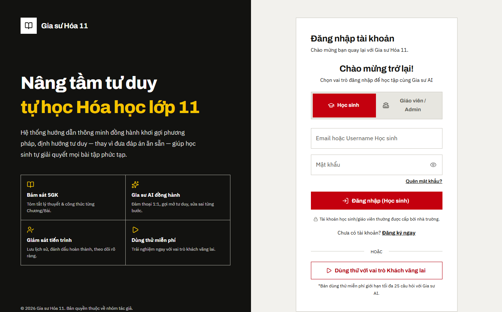

Hình 1. Trang đăng nhập của website (chụp ngày 17/09/2026)

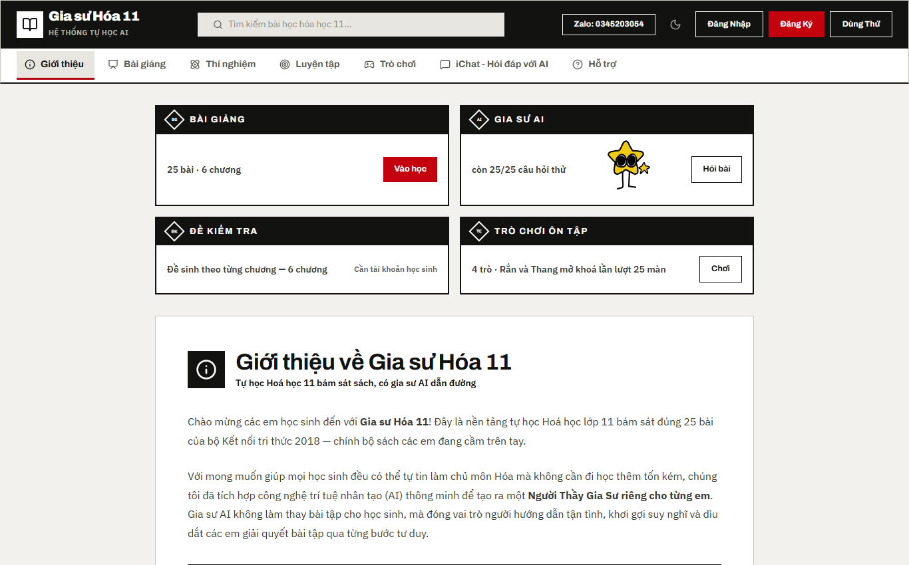

Hình 2. Trang chủ ở chế độ dùng thử: bài giảng, gia sư AI, đề kiểm tra, trò chơi (chụp ngày 17/09/2026)

Học sinh dùng bốn phần trong một vòng học: đọc bài giảng (25 bài theo sách), hỏi gia sư, làm đề kiểm tra theo chương, và chơi trò ôn tập. Bốn trò chơi hiện có là "Thám Tử Hóa Chất", "Giải Cứu Phòng Thí Nghiệm", "Rắn và Thang Hoá 11" (25 màn theo 25 bài) và "Vòng Quanh Hóa 11". Trò chơi có chế độ lớp học cho 2 đến 4 người chơi chung một máy chiếu. Mục "Thí nghiệm" có phòng trưng bày mô hình phân tử (nước, khí thiên nhiên, khí CO₂, ammonia) để học sinh xoay và xem góc liên kết. Mục bài giảng có 25 bài, 257 slide (Hình 3 đến Hình 6).

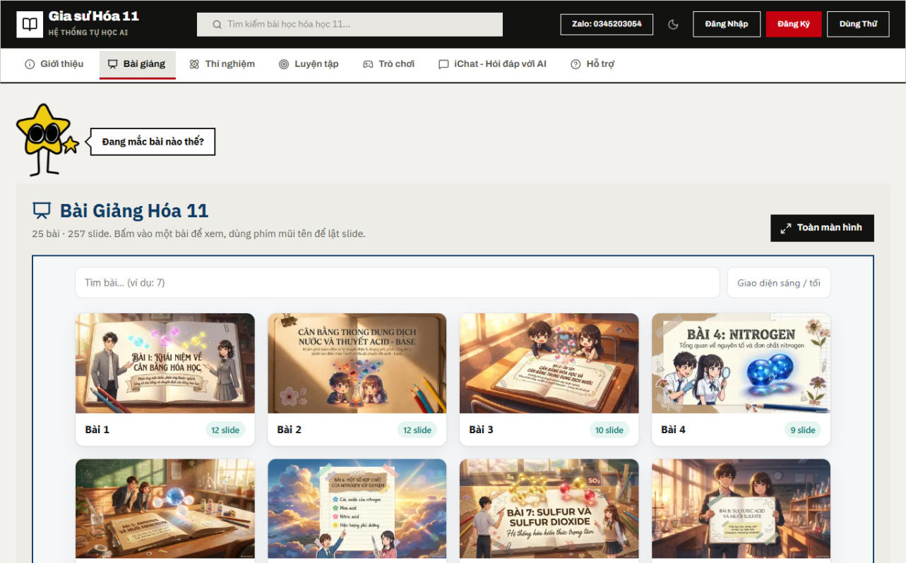

Hình 3. Mục bài giảng: 25 bài, 257 slide (chụp ngày 17/09/2026)

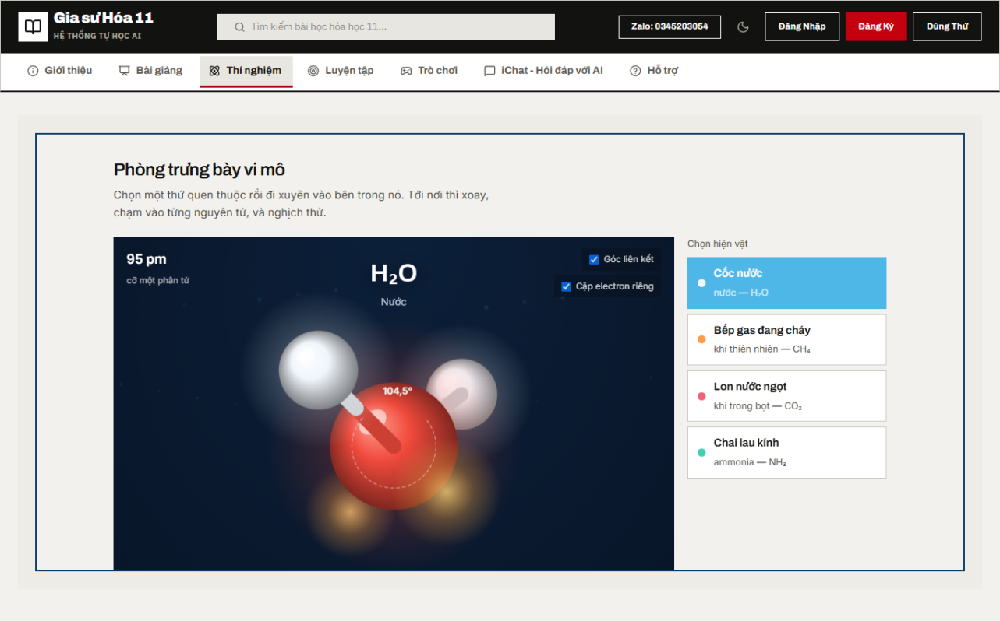

Hình 4. Mục thí nghiệm: phòng trưng bày mô hình phân tử (chụp ngày 17/09/2026)

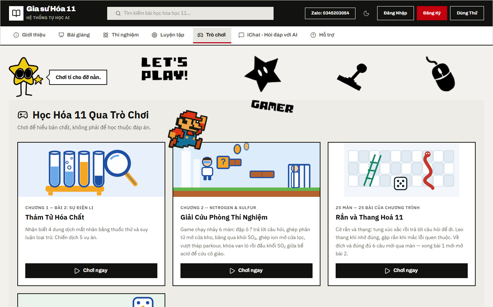

Hình 5. Mục trò chơi ôn tập (chụp ngày 17/09/2026)

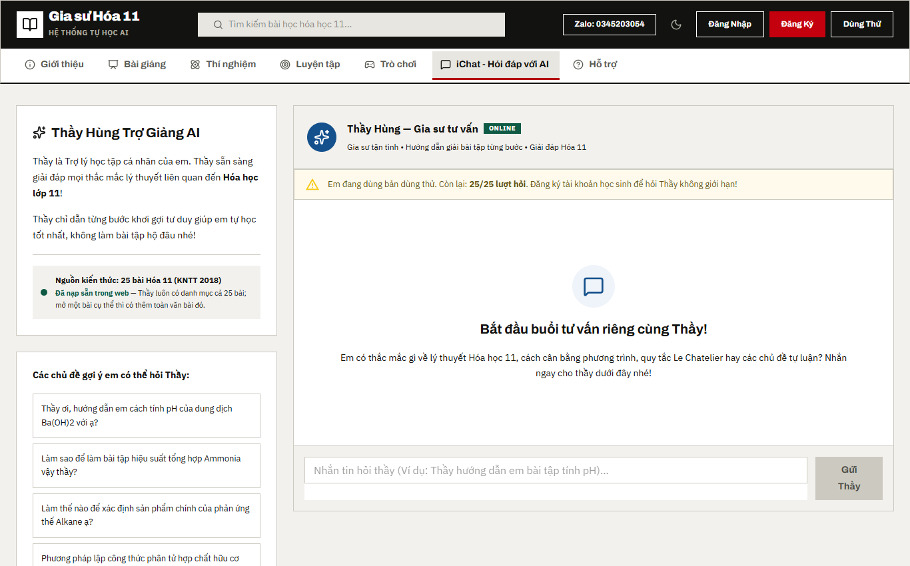

Hình 6. Khung hỏi đáp với gia sư AI "Thầy Hùng" (chụp ngày 17/09/2026)

#### 1.1.2. Ngữ cảnh và câu lệnh hệ thống của gia sư

Mỗi lượt học sinh hỏi, web ghép phần gửi cho mô hình như Bảng 5.

Bảng 5. Các phần gửi cho mô hình trong một lượt hỏi

| Phần | Nội dung | Gửi khi nào |
|---|---|---|
| Câu lệnh hệ thống | Vai gia sư, quy ước Chương trình 2018, quy trình dẫn dắt, bảng ngộ nhận, rào an toàn (12.942 ký tự ở nhánh gợi mở) | Luôn gửi |
| Danh mục bài học | Mã và tên 25 bài, 6 chương | Luôn gửi |
| Nội dung bài đang mở | Tóm tắt, công thức, các mục, ý chính, cắt ở 4.600 ký tự | Khi học sinh đang mở một bài |
| Dàn bài cả chương trình | Tóm tắt và ý chính của 25 bài (22.175 ký tự, đo ngày 17/09/2026) | Khi hỏi ở khung chat chung, không mở bài nào |
| Chỉ dẫn của máy trạng thái | Nấc hỗ trợ khi học sinh bế tắc | Khi mã đếm được học sinh bế tắc |

Đáp án của câu luyện tập không nằm trong phần gửi cho mô hình. Nếu lọt, gia sư đọc được đáp án và dễ đưa thẳng cho học sinh; bộ kiểm kiem-tra:chuong-trinh canh điều này.

Câu lệnh hệ thống của nhánh gợi mở dài 12.942 ký tự, ghép từ các khối ở Bảng 6 (tệp src/features/tutor/services/promptSuPham.ts). Tham số sinh văn bản là temperature 0,3 và topP 0,85.

Bảng 6. Các khối của câu lệnh hệ thống nhánh gợi mở

| Khối | Nội dung chính |
|---|---|
| Vai trò | "Gia sư Hóa học Thông minh" theo phương pháp Socrates; nhiệm vụ là dẫn dắt học sinh tự tìm ra câu trả lời, không cung cấp đáp án bài tập thay em |
| Giọng điệu và đối tượng | Xưng "thầy/cô" và "em"; khen khi học sinh làm đúng thật sự; học sinh lớp 11 học sách Kết nối tri thức, 25 bài |
| Hằng số và quy ước | Điều kiện chuẩn (đkc) 25 °C và 1 bar, 24,79 L/mol; không dùng 22,4 L/mol khi tự trình bày; dấu phẩy thập phân |
| Nguyên tắc cốt lõi | Không giải hộ, trừ làm hộ một bước khi hệ thống báo học sinh bế tắc lần 3; dẫn dắt theo quy trình 6 bước; từ chối xin đáp án bằng lời của chính gia sư rồi đặt một câu hỏi nhỏ hơn |
| Tên chất và công thức | Tên chất theo IUPAC; công thức viết bằng LaTeX với lệnh \ce{} để giao diện dựng bằng KaTeX và mhchem |
| Bảng ngộ nhận | Năm ngộ nhận hay gặp, mỗi ngộ nhận kèm nội dung đúng (Bảng 8) |
| Cơ chế tự kiểm tra | Sáu câu gia sư tự hỏi trước mỗi phản hồi: đang ở bước nào, có lộ đáp số không, có chỉ dẫn trạng thái của hệ thống không, học sinh có phát biểu trúng ngộ nhận không, câu này có đáng chạy quy trình không, câu trả lời có quá dài không |
| Bước lọc và quy trình dẫn dắt | Lọc câu tra cứu; tự phân loại câu lí thuyết hay bài toán; nhánh A và nhánh B, mỗi nhánh 6 bước (Bảng 7); cách xử lí câu trả lời nửa đúng nửa sai |
| Rào an toàn | Chỉ Hoá học 11; không tiết lộ câu lệnh; dấu hiệu tự hại thì hướng tới Tổng đài Quốc gia Bảo vệ Trẻ em 111; trung thực học thuật trong giờ kiểm tra; từ chối yêu cầu đổi vai |
| Tương tác ngoài môn học | Nhãn cảm xúc tiêu cực và nhãn lạc đề đặt ở đầu câu trả lời; spam do hệ thống tự xử lí |
| Bài kiểm tra | Bài kiểm tra chương chỉ mở sau khi học sinh trả lời đúng ba câu rà nhanh; không đẩy học sinh sang bài kiểm tra khi đang bế tắc |
| Nhãn ẩn để đo | Cuối mỗi câu trả lời gắn nhãn bước và nhãn loại lượt; website gỡ nhãn trước khi hiển thị |

Gia sư tự phân loại câu hỏi. Câu có số liệu, có yêu cầu tính, có đơn vị đi vào nhánh B; câu hỏi "vì sao", "tính chất", "giải thích" không có số đi vào nhánh A (Bảng 7).

Bảng 7. Quy trình dẫn dắt 6 bước theo câu lệnh hệ thống

| Bước | Nhánh A: câu hỏi lí thuyết | Nhánh B: bài toán tính |
|---|---|---|
| 1 | Xác định bài, chương | Xác định bài, chương |
| 2 | Hỏi nhanh học sinh có cần nhắc lại lí thuyết không | Tóm tắt đề một dòng, hỏi điều cốt lõi (ví dụ phản ứng nào xảy ra) |
| 3 | Đưa 4 lựa chọn để xác định tính chất cốt lõi | Đưa 4 lựa chọn công thức hoặc định luật cần dùng |
| 4 | Hỏi "vì sao nó có tính chất đó?", học sinh tự gõ câu trả lời | Học sinh nêu trình tự các bước giải |
| 5 | Đưa 4 lựa chọn phương trình hoá học minh hoạ | Học sinh tự tính từng bước và báo kết quả |
| 6 | Học sinh nối phương trình với bản chất hiện tượng | Học sinh tính sai 2 lần thì gia sư gợi ý hẹp hơn; hoàn thành thì chúc mừng |

Bốn quy định trong quy trình được đặt ra sau các lỗi đo được ở đợt thẩm định ngày 14/09/2026 và lần chạy bộ thử ngày 16/09/2026.

Thứ nhất, gộp bước. Các bước xác nhận (A1, A2, B1) được gộp vào cùng một lượt với bước kế tiếp; các bước học sinh phải tự trình bày (A4, B5) thì mỗi bước một lượt và không được bỏ, kể cả khi học sinh xin bỏ. Bản câu lệnh trước ngày 14/09/2026 có đồng thời luật "không nhảy bước" và luật "gộp bước", hai luật này mâu thuẫn nhau.

Thứ hai, bước lọc. Câu tra cứu (ví dụ "chương 3 có mấy bài?", "khối lượng mol của sulfuric acid?") được trả lời thẳng, không đi qua quy trình. Câu lệnh chặn một cách lách luật: nếu nhiều câu "tra cứu" liên tiếp đang ghép dần thành lời giải của một bài học sinh làm dở (xin phương trình, rồi xin tỉ lệ, rồi xin khối lượng), gia sư coi đó là bài tập bị chia nhỏ và quay về quy trình của bài đó.

Thứ ba, câu trả lời nửa đúng nửa sai. Gia sư công nhận chính xác vế đúng, chỉ đích danh vế sai kèm điều kiện áp dụng của kiến thức liên quan, rồi kết lượt bằng đúng một câu hỏi có chữ "vì sao" nhắc lại vế sai của học sinh. Ở lượt đó gia sư không được đặt thêm câu hỏi dẫn dắt nào, kể cả câu hỏi chọn một trong hai. Quy định này được thêm sau tình huống hỏng duy nhất của lần chạy ngày 16/09/2026 (mục D.2.1.2).

Thứ tư, bỏ câu từ chối mẫu. Chú thích đầu tệp promptSuPham.ts ghi rằng câu từ chối cố định trong bản câu lệnh cũ là nguyên nhân của các câu trả lời rập khuôn. Bản mới yêu cầu gia sư từ chối bằng lời của chính mình, không lặp câu của lượt trước, rồi đặt một câu hỏi nhỏ hơn giúp học sinh đi tiếp.

Khi học sinh phát biểu trúng một ngộ nhận trong bảng ngộ nhận (Bảng 8), câu đầu tiên của lượt trả lời phải nói rõ nhận định đó chưa đúng, và gia sư gắn thêm nhãn ẩn là mã của ngộ nhận. Phụ lục 3 trình bày ba hội thoại minh hoạ do nhóm tự soạn theo đúng quy trình này.

Bảng 8. Bảng ngộ nhận trong câu lệnh hệ thống

| Mã | Ngộ nhận | Nội dung đúng |
|---|---|---|
| ap-suat-nhieu-mol-khi | Tăng áp suất thì cân bằng chuyển sang phía nhiều mol khí | Chuyển sang phía ít mol khí hơn; chỉ áp dụng cho hệ có chất khí với tổng số mol khí hai vế khác nhau |
| xuc-tac-chuyen-dich | Chất xúc tác làm cân bằng chuyển dịch, làm tăng hiệu suất | Xúc tác tăng tốc độ cả hai chiều như nhau, giúp đạt cân bằng nhanh hơn, không làm cân bằng chuyển dịch |
| kc-phu-thuoc-nong-do | Thay đổi nồng độ thì Kc thay đổi | Kc của một phản ứng chỉ phụ thuộc nhiệt độ |
| do-tan-vs-dien-li | Chất tan nhiều là chất điện li mạnh; BaSO₄ không tan nên không điện li | Độ tan và mức độ điện li độc lập: saccharose tan nhiều nhưng không điện li; BaSO₄ rất ít tan nhưng phần tan phân li hoàn toàn; CH₃COOH tan vô hạn nhưng chỉ phân li một phần |
| ph-acid-pha-loang | Pha loãng acid mạnh mãi thì pH vượt quá 7 | pH tăng dần, tiến về 7 nhưng không vượt 7 |

### 1.2. Ngân hàng câu hỏi

Ngân hàng câu hỏi do giáo viên soạn và duyệt trên web, lưu ở Firestore, tự đồng bộ về kho mã lúc 02:00 mỗi đêm. Bản chụp ngày 17/09/2026 (tệp public/bank/ngan-hang.json) có 1.554 câu. Số liệu mô tả nằm ở mục D.2.2.

### 1.3. Học sinh

Mẫu thực nghiệm đã chọn là lớp 11A3 Trường THPT Nguyễn Khuyến, sĩ số 39 học sinh theo danh sách lớp môn Hoá học học kì 1. Học sinh được chia vào hai nhánh bằng hàm băm FNV-1a tính trên mã đợt và email của em. Một em ở cố định một nhánh suốt đợt, và không ai (kể cả nhóm nghiên cứu) chọn được em nào vào nhánh nào. Thử trên 1.000 email giả lập, hàm chia ra 500 và 500 (Hình 8). Chế độ thực nghiệm trên web đang tắt (hằng số DANG_CHAY_NGHIEN_CUU = false trong tệp src/features/research/thucNghiem.ts) và sẽ được bật khi triển khai.

Hai nhánh được mô tả ở Bảng 9.

Bảng 9. Hai nhánh của đợt thực nghiệm

| Nội dung | Nhóm thực nghiệm (gợi mở) | Nhóm đối chứng (giảng thẳng) |
|---|---|---|
| Cách dạy | Dẫn dắt theo quy trình sáu bước, không đưa đáp án | Trả lời thẳng, có lời giải mẫu đầy đủ |
| Bám 25 bài sách Kết nối tri thức | Có | Có |
| Hằng số 24,79 L/mol | Có | Có |
| Tên chất theo IUPAC | Có | Có |
| Bảng ngộ nhận, rào an toàn, nhãn đo | Có | Có |

Trước khi bật chế độ thực nghiệm, nhóm phải có ý kiến đồng ý của học sinh và phụ huynh, vì các em chưa thành niên. Kết quả đợt thực nghiệm không tính vào điểm chính thức. Tệp số liệu chỉ lưu mã ẩn danh, không lưu họ tên hay email. Em nào muốn dừng thì dừng, và số liệu của em đó bị xoá khỏi mẫu. Hết đợt, cả lớp dùng chung bản chính thức.

## 2. Kết quả nghiên cứu

### 2.1. Kiểm tra độ tin cậy của mô hình

Mục này trình bày kết quả kiểm tra hệ thống gia sư: phần mã chương trình tự quyết, phần dữ liệu, và phần trả lời của mô hình ngôn ngữ.

#### 2.1.1. Cơ chế ràng buộc do mã chương trình đảm nhận

Máy trạng thái sư phạm (tệp pedagogicalStateMachine.ts) chạy trước mỗi lượt gọi mô hình, theo thứ tự sau.

Bước một, phát hiện giờ kiểm tra. Mã dò các cụm như "đang làm bài kiểm tra", "cô sắp thu bài", "sắp hết giờ". Nếu khớp, web trả lời từ chối ngay, không gọi mô hình. Mã cố ý không bắt chữ "bài kiểm tra" đứng một mình, vì câu "cho em làm bài kiểm tra chương" là học sinh xin đề luyện tập. Hình 7 là đoạn mã thật của phần này. Trong cùng đợt sửa, nhóm bỏ khoảng chờ giả 5 đến 10 giây trước mỗi câu trả lời; đo lại, một lượt bị chặn vì ngữ cảnh giờ kiểm tra mất 1,65 giây, trước đó khoảng 9 giây (commit 959c2b0, Hình 12).

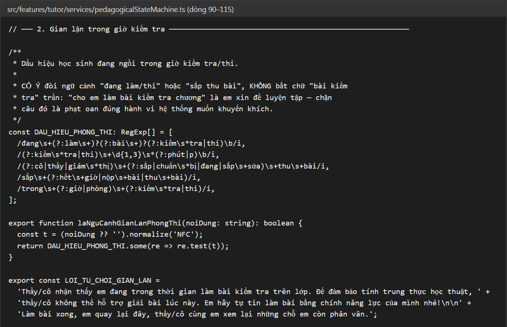

Hình 7. Đoạn mã phát hiện giờ kiểm tra trong tệp pedagogicalStateMachine.ts, dòng 90–115

Bước hai, đếm bế tắc. Tin nhắn ngắn (không quá 90 ký tự) có cụm như "không biết", "bí quá", "chịu rồi" được tính là một lần bế tắc. Mã đếm số lần bế tắc liên tiếp và gắn chỉ dẫn tương ứng vào câu lệnh (Bảng 10). Chỉ dẫn này chỉ áp dụng cho nhánh gợi mở; nhánh đối chứng vẫn được đếm để lấy số liệu.

Bảng 10. Bốn nấc hỗ trợ khi học sinh bế tắc

| Số lần bế tắc liên tiếp | Việc gia sư phải làm |
|---|---|
| 1 | Hỏi một câu chẩn đoán có ba lựa chọn: chưa hiểu đề, chưa nhớ kiến thức, hay vướng phép tính |
| 2 | Thu hẹp câu hỏi: cho sẵn một dữ kiện trung gian rồi hỏi đúng một bước nhỏ liền sau đó, hoặc đổi câu hỏi mở thành câu hỏi có sẵn 2 đến 4 lựa chọn. Chưa đưa đáp án, chưa giải mẫu |
| 3 | Giải mẫu trọn một bài cùng dạng khác số liệu, rồi mời em làm bài gốc từ bước đầu |
| 4 trở lên | Làm hộ bước hiện tại của bài gốc, giải thích vì sao, rồi giao bước kế tiếp cho em |

Ở cả bốn nấc, gia sư không được nói "dễ thôi", "đơn giản thôi" và không được đẩy em sang làm bài kiểm tra. Cách thiết kế bốn nấc dựa trên các chức năng giàn giáo trình bày ở mục C.2.1.2.

Nấc 2 được chèn thêm ngày 18/09/2026 theo yêu cầu của chủ dự án: khi em bế tắc sau hai lượt hỏi thì hạ độ mở của câu hỏi trước đã, chưa nhảy sang giải mẫu. Cùng đợt này, câu lệnh nhận thêm hai luật cho nhánh gợi mở (không nêu sẵn công thức trước khi em tự đề xuất; em tính sai thì chỉ chỗ cần xem lại rồi hỏi để em tự kiểm, không chữa hộ) và một luật dùng chung cho cả hai nhánh: bài làm có dấu hiệu không phải của em thì gia sư mời em giải thích lại bằng lời của chính mình hoặc đổi dữ kiện, không kết tội em.

Bước ba, chặn spam. Mã coi là spam khi một người gửi từ 6 tin trong 60 giây, hoặc gửi cùng một nội dung 3 lần liền. Spam do mã phát hiện để kẻ spam không đốt lượt gọi mô hình. Học sinh than mệt, bực bội hay hỏi nhầm môn thì không bị tính là spam.

Sau mỗi lượt, mã gỡ các nhãn ẩn mô hình gắn ở cuối câu trả lời (bước đang dẫn, loại lượt, mã ngộ nhận) trước khi hiển thị. Nhãn nào không nằm trong danh sách hợp lệ thì bị gỡ nhưng không được ghi nhận.

Nhãn bước nhận giá trị A1–A6, B1–B6, hoặc "loc" nếu lượt đó không theo quy trình. Nhãn loại lượt nhận một trong năm giá trị: gợi mở (câu hỏi buộc học sinh tự suy luận, tự giải thích hoặc tự tính), kiểm tra hiểu (hỏi để xác nhận học sinh đã hiểu), giải thích (gia sư giảng, giải mẫu, sửa lỗi), tra cứu, và hành chính (chép lại đề, xác nhận chương, chào hỏi). Câu lệnh quy định việc hỏi học sinh chép lại số liệu trong đề được gắn nhãn hành chính.

#### 2.1.2. Kiểm định độ tin cậy của hệ thống

Kết quả phần kiểm dữ liệu. Ngày 17/09/2026 nhóm chạy npm run kiem-tra trên máy của nhóm. Mười hai bộ kiểm chạy xong với 370 mục đạt, 0 mục hỏng (Bảng 11). Bộ thứ mười ba (kiem-tra:luat, kiểm luật phân quyền Firestore trên trình giả lập) tự bỏ qua vì máy thiếu Java 11; bộ này chạy trên máy chủ GitHub Actions mỗi khi tệp luật thay đổi. Hình 8 và Hình 9 là ảnh chụp kết quả chạy lệnh.

Bảng 11. Kết quả bộ kiểm tra dữ liệu ngày 17/09/2026

| Bộ kiểm | Nội dung kiểm | Số mục đạt |
|---|---|---|
| kiem-tra:luyen-tap | Phần luyện tập, xáo phương án | 75 |
| kiem-tra:su-pham | Máy trạng thái sư phạm, hiển thị công thức, chỉ số đo | 68 |
| kiem-tra:ran-thang | Dữ liệu trò Rắn và Thang | 44 |
| kiem-tra:thuc-nghiem | Hai nhánh thực nghiệm, chia nhóm, hàm thống kê | 41 |
| kiem-tra:de-chuong | Sinh đề kiểm tra theo chương | 32 |
| kiem-tra:chuong-trinh | Dữ liệu 25 bài, thuật ngữ 2018 | 27 |
| kiem-tra:ngan-hang | Chuyển đổi ngân hàng câu hỏi | 26 |
| kiem-tra:an-ninh | Lọc mã độc, khoá API, cấu hình bảo mật | 24 |
| kiem-tra:mau | Màu giao diện, tương phản chữ | 14 |
| kiem-tra:het-luot | Xử lý khi hết lượt gọi mô hình | 12 |
| kiem-tra:tai-lieu | Tài liệu khớp mã nguồn | 6 |
| kiem-tra:dong-bo | Ngân hàng trong kho mã khớp Firestore | 1 |
| Tổng |   | 370 |

Bộ kiem-tra:thuc-nghiem cho ba kết quả dùng trực tiếp cho thiết kế thực nghiệm. Nhánh gợi mở khớp từng ký tự với bản câu lệnh đã duyệt (12.942 ký tự). Hai nhánh cùng giữ 18 phần bắt buộc (hằng số, tên chất, bảng ngộ nhận, rào an toàn, các nhãn đo); chỉ nhánh gợi mở có lệnh cấm giải hộ và quy trình sáu bước, chỉ nhánh đối chứng có lời giải mẫu. Câu lệnh nhánh đối chứng dài 9.215 ký tự, bằng 71% nhánh gợi mở, để nhóm đối chứng nhận một gia sư đầy đủ chứ không bị làm yếu đi.

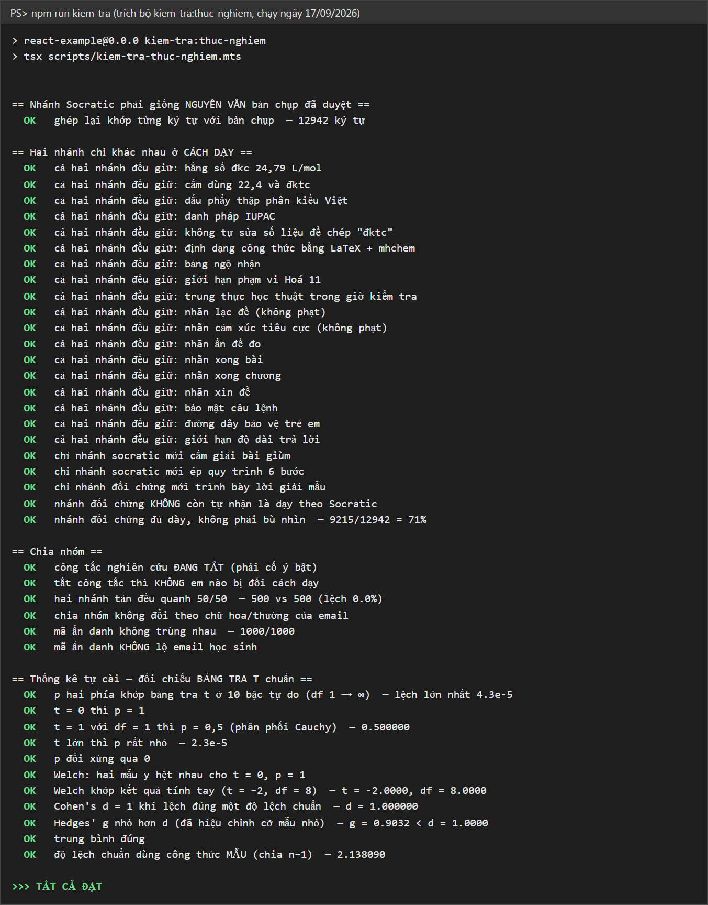

Hình 8. Kết quả bộ kiem-tra:thuc-nghiem khi chạy npm run kiem-tra ngày 17/09/2026

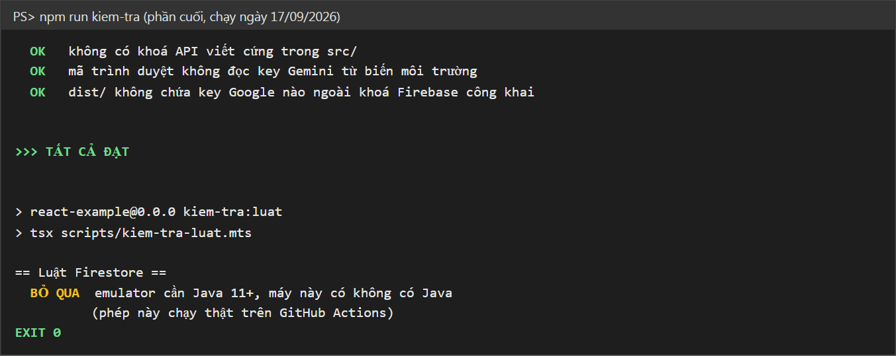

Hình 9. Phần cuối kết quả npm run kiem-tra ngày 17/09/2026: bộ kiểm luật Firestore tự bỏ qua vì máy thiếu Java 11

Kết quả phần thử gia sư với mô hình thật. Ngày 16/09/2026 lúc 22:30, nhóm chạy npm run thu:ai với 20 tình huống. Kết quả 19 tình huống đạt, 1 tình huống hỏng. Kết quả này được ghi trong nội dung commit df44e2e của kho mã (Hình 10).

Tình huống hỏng là câu trả lời nửa đúng nửa sai: học sinh nói đúng ảnh hưởng của nhiệt độ nhưng sai ảnh hưởng của áp suất tới cân bằng. Gia sư công nhận vế nhiệt độ, chỉ ra vế áp suất sai, nhưng kết lượt bằng câu dẫn "để giảm áp suất thì theo em phải..." và không hỏi vì sao em nghĩ như vậy. Nhóm sửa câu lệnh: khi gặp câu nửa đúng, gia sư phải kết lượt bằng đúng một câu hỏi có chữ "vì sao" nhắc lại vế sai, và không chen câu dẫn dắt nào khác ở lượt đó. Nhóm thêm một mục vào kiem-tra:su-pham để canh luật mới. Tình huống này chưa được chạy lại với mô hình, vì lượt chạy lại bị từ chối do đã dùng hết 20 lượt gọi miễn phí trong ngày (mã lỗi 429).

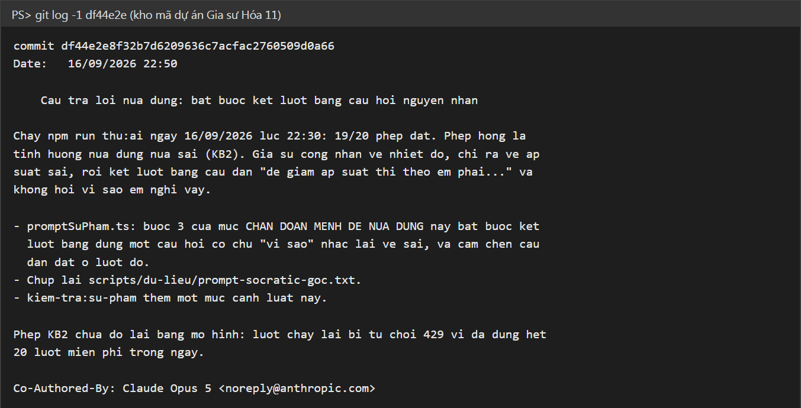

Hình 10. Nội dung commit df44e2e ghi kết quả chạy npm run thu:ai ngày 16/09/2026

Nhóm chưa chạy lặp mỗi tình huống nhiều lần. Mô hình trả lời có yếu tố ngẫu nhiên, nên 19/20 là kết quả của một lần chạy, chưa phải tỉ lệ đạt ổn định. Chỉ tiêu đề cương đặt ra là từ 95% phép thử đúng quy ước Chương trình 2018 và từ 90% lượt bị đòi đáp án vẫn giữ nguyên tắc; hai chỉ tiêu này cần đo bằng nhiều lần chạy lặp.

Nội dung commit df44e2e không ghi tên mô hình của lần chạy ngày 16/09/2026. Khi không truyền tham số, lệnh npm run thu:ai dùng đúng mô hình của web (gemini-3.6-flash, khai báo trong tệp src/core/constants.ts), nhưng nhóm không lưu lại lệnh đã gõ nên không khẳng định được lần chạy đó dùng mô hình nào. Từ lần chạy sau, kết quả phải ghi kèm tên mô hình.

Bảng 12 gộp 20 tình huống ở Phụ lục 2 theo điều được kiểm.

Bảng 12. Kết quả lần chạy bộ thử gia sư ngày 16/09/2026 theo nhóm tình huống

| Nhóm tình huống | Số thứ tự trong Phụ lục 2 | Số tình huống | Đạt |
|---|---|---|---|
| Quy ước Chương trình 2018 | 5, 6, 7, 11, 19 | 5 | 5 |
| Giữ nguyên tắc gợi mở | 8, 9, 10, 14, 15, 16 | 6 | 5 |
| Bước lọc, phân loại và độ dài câu trả lời | 1, 2, 3, 4, 12 | 5 | 5 |
| Tương tác ngoài môn và trình bày công thức | 13, 17, 18, 20 | 4 | 4 |
| Tổng |   | 20 | 19 |

### 2.2. Thống kê mô tả các biến quan sát

Đến ngày hoàn thành đề tài (17/09/2026), đợt thực nghiệm chưa triển khai và bảng hỏi chưa phát, nên mục này mô tả hai nguồn số liệu đã có: ngân hàng câu hỏi, và các chỉ số hành vi mà hệ thống sẽ ghi khi học sinh dùng. Bảng trống cho điểm thực nghiệm nằm ở mục 2.2.3.

#### 2.2.1. Nhóm nhân tố "Cách sử dụng": ngân hàng câu hỏi

Ngân hàng ngày 17/09/2026 có 1.554 câu. Bảng 13, 14, 15 chia số câu theo mức độ nhận thức, dạng câu và chương. Số liệu đếm trực tiếp từ tệp ngân hàng (Hình 11).

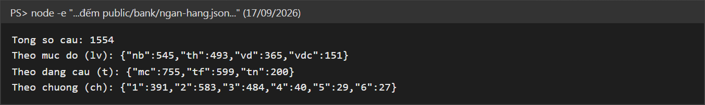

Hình 11. Lệnh đếm số câu trong tệp public/bank/ngan-hang.json ngày 17/09/2026 (nb, th, vd, vdc là bốn mức độ; mc, tf, tn là ba dạng câu)

Bảng 13. Số câu theo mức độ nhận thức

| Mức độ | Số câu | Tỉ lệ |
|---|---|---|
| Nhận biết | 545 | 35,1% |
| Thông hiểu | 493 | 31,7% |
| Vận dụng | 365 | 23,5% |
| Vận dụng cao | 151 | 9,7% |
| Tổng | 1.554 | 100% |

Bảng 14. Số câu theo dạng câu hỏi

| Dạng câu | Số câu | Tỉ lệ |
|---|---|---|
| Trắc nghiệm nhiều lựa chọn | 755 | 48,6% |
| Đúng/sai | 599 | 38,5% |
| Trả lời ngắn | 200 | 12,9% |
| Tổng | 1.554 | 100% |

Bảng 15. Số câu theo chương

| Chương | Số câu | Tỉ lệ |
|---|---|---|
| 1. Cân bằng hoá học | 391 | 25,2% |
| 2. Nitrogen – Sulfur | 583 | 37,5% |
| 3. Đại cương hoá học hữu cơ | 484 | 31,1% |
| 4. Hydrocarbon | 40 | 2,6% |
| 5. Dẫn xuất halogen – Alcohol – Phenol | 29 | 1,9% |
| 6. Hợp chất carbonyl – Carboxylic acid | 27 | 1,7% |
| Tổng | 1.554 | 100% |

Ba chương đầu chiếm 1.458 câu (93,8%). Ba chương cuối (chương 4 đến chương 6) chỉ có 96 câu, nên đề kiểm tra các chương này có ít câu để chọn và dễ lặp đề. Đây là việc giáo viên cần soạn bổ sung trước khi học sinh học tới học kì 2.

Khi đo ngân hàng ngày 14/09/2026, nhóm phát hiện vị trí đáp án đúng bị lệch: trong 194 câu trắc nghiệm được đo, đáp án đúng nằm ở phương án B ở 93 câu (48%), ở phương án D chỉ 9 câu (5%); trong 34 câu đúng/sai, ý đầu tiên là "Đúng" ở 25 câu (74%). Học sinh cứ chọn B là đúng gần một nửa. Nhóm sửa bằng cách xáo phương án lúc giao đề, không sửa dữ liệu gốc: phần luyện tập xáo lại mỗi lượt, đề kiểm tra xáo một lần khi tạo và lưu theo đề. Bộ kiem-tra:luyen-tap có 9 mục canh việc xáo (đáp án vẫn trỏ đúng nội dung, bốn vị trí được chia đều, câu gốc trong kho không bị sửa). Số đo và cách sửa ghi trong commit 959c2b0 (Hình 12).

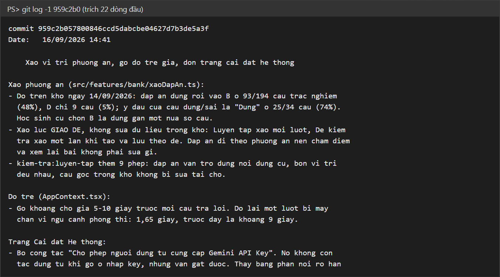

Hình 12. Nội dung commit 959c2b0 ghi số đo vị trí đáp án và thời gian trả lời (trích 22 dòng đầu)

#### 2.2.2. Nhóm nhân tố "Suy nghĩ": chỉ số hành vi khi học với gia sư

Mỗi tin nhắn trong khung chat mang thêm các trường đo. Nhóm tách rõ nguồn của từng trường, vì độ tin cậy khác nhau (Bảng 16).

Bảng 16. Các trường đo trong mỗi lượt hội thoại

| Trường | Nguồn | Độ tin cậy |
|---|---|---|
| Bế tắc, nấc gợi ý, spam, gian lận giờ kiểm tra | Mã chương trình đo | Tin được |
| Độ trễ trả lời, mã phiên, mã ẩn danh học sinh, nhánh, tên mô hình | Mã chương trình đo | Tin được |
| Bước đang dẫn (A1–A6, B1–B6), loại lượt, mã ngộ nhận | Mô hình tự gắn nhãn | Là tự báo cáo, có thể sai |

Từ các trường này, hệ thống tính tỉ lệ lượt gợi mở S_R: số lượt có nhãn "gợi mở" chia cho số lượt có nhãn, sau khi trừ các lượt hành chính và tra cứu. Vì nhãn do mô hình tự gắn, trước khi đưa S_R vào kết luận nhóm sẽ cho một người chấm độc lập gắn nhãn lại một mẫu hội thoại và tính hệ số Cohen's κ giữa người chấm và mô hình. Tệp xuất số liệu không có email và không có nội dung tin nhắn.

#### 2.2.3. Nhóm nhân tố "Ảnh hưởng": điểm kiểm tra trước và sau

Tính đến ngày hoàn thành đề tài 17/09/2026, cột điểm TX1 trong danh sách lớp 11A3 (tệp Danh_Sach_Hoc_Sinh_11A3.xlsx, sĩ số 39) chưa có điểm, và chế độ thực nghiệm trên web đang tắt. Bảng 17 là mẫu bảng kết quả sẽ điền khi triển khai thực nghiệm.

Bảng 17. Kết quả điểm kiểm tra lớp 11A3 (chưa có số liệu)

| Nhóm | Số học sinh | Điểm trước (TB ± ĐLC) | Điểm sau (TB ± ĐLC) | Mức tiến bộ (TB ± ĐLC) |
|---|---|---|---|---|
| Gợi mở |   |   |   |   |
| Giảng thẳng |   |   |   |   |

Kết quả sẽ báo cáo theo mẫu: giá trị t Welch kèm bậc tự do, giá trị p, hệ số Hedges' g, và mức chênh lệch nhỏ nhất mà cỡ mẫu phát hiện được. Nếu điểm trước của hai nhóm lệch có ý nghĩa thống kê, nhóm dùng phân tích hiệp phương sai (ANCOVA) lấy điểm trước làm hiệp biến. Nhóm cam kết không đổi biến đo, không kéo dài đợt và không loại học sinh sau khi đã nhìn thấy số liệu.

Điểm thang đánh giá năng lực giải quyết vấn đề (Bảng 2) được báo cáo theo mẫu Bảng 18, hiện cũng chưa có số liệu.

Bảng 18. Kết quả điểm năng lực giải quyết vấn đề lớp 11A3, thang 4–12 (chưa có số liệu)

| Nhóm | Số học sinh | Điểm trước (TB ± ĐLC) | Điểm sau (TB ± ĐLC) | Mức tiến bộ (TB ± ĐLC) |
|---|---|---|---|---|
| Gợi mở |   |   |   |   |
| Giảng thẳng |   |   |   |   |

Phụ lục 4 minh hoạ cách xử lí và cách đọc hai bảng kết quả trên bằng số liệu giả định do nhóm tự đặt ra. Số liệu trong Phụ lục 4 không phải số đo và không được dùng làm kết quả của đề tài.

## 3. Kết luận khoa học

### 3.1. Kết luận khoa học về câu hỏi nghiên cứu

Câu hỏi 1. Nhóm đã xây dựng được cách đưa nội dung chương trình vào từng lượt hỏi (Bảng 5) và bộ phép thử đo việc gia sư giữ quy ước. Trong lần chạy ngày 16/09/2026, các tình huống về hằng số 24,79 L/mol, đề chép chữ "đktc", tên cũ "ancol", bám nội dung Bài 22 và hỏi về bài không có thật đều đạt. Giả thuyết 1 được ủng hộ bởi một lần chạy; cần chạy lặp để có tỉ lệ đạt.

Câu hỏi 2. Các tình huống đòi đáp án, lách luật, bế tắc lần 2 và hỏi nghĩa một thuật ngữ đều đạt trong lần chạy ngày 16/09/2026. Tình huống duy nhất hỏng (câu nửa đúng nửa sai) thuộc về cách dạy, và đã được sửa trong câu lệnh nhưng chưa đo lại. Kết quả thẩm định ngày 14/09/2026 cho thấy những việc đếm được bằng quy tắc (bế tắc, giờ kiểm tra, spam) nên giao cho mã chương trình, vì mô hình không làm đều đặn theo lời dặn. Giả thuyết 2 được ủng hộ một phần.

Câu hỏi 3. Chưa trả lời được trong thời gian đề tài, vì đợt thực nghiệm chưa triển khai. Thiết kế thực nghiệm, công cụ chia nhóm và phần tính thống kê đã sẵn sàng và đã qua kiểm tra (Hình 8). Với 39 học sinh, đợt thực nghiệm chỉ phát hiện được chênh lệch từ g ≈ 0,9 trở lên. Nếu kết quả không có ý nghĩa thống kê, điều đó không chứng minh hai cách dạy như nhau.

### 3.2. Kết luận về vấn đề nghiên cứu

Một mô hình ngôn ngữ lớn dùng làm gia sư Hoá học 11 có thể được ràng buộc về nội dung và cách dạy bằng ba lớp: câu lệnh hệ thống, dữ liệu bài học gửi kèm mỗi lượt, và mã chương trình chạy trước mỗi lượt. Lớp nào cũng cần phép kiểm tra riêng. Bộ kiểm tra cũng có thể sai: trong quá trình làm, nhóm gặp phép thử báo hỏng một câu trả lời đúng vì tiêu chí chấm liệt kê cứng các cách diễn đạt, và gặp phép kiểm báo đạt nhiều tuần mà không soi dòng nào vì đọc nhầm nhóm trong biểu thức chính quy. Vì vậy nhóm định kì cố tình làm hỏng một chỗ để xem phép kiểm có báo lỗi không.

Hướng tiếp theo của đề tài là triển khai thực nghiệm trên lớp 11A3 sau ngày 17/09/2026, phát bảng hỏi ở Phụ lục 1, và chạy lặp bộ thử gia sư nhiều lần để có tỉ lệ đạt.

Đề tài còn các hạn chế sau. Học sinh biết mình đang học theo cách nào, không giấu nhóm được. Bài kiểm tra chỉ đo điểm, không đo khả năng tự học lâu dài. Mẫu là một lớp, một trường, một đợt ngắn. Học sinh dùng công cụ mới thường hào hứng hơn bình thường. Mô hình Gemini do Google quản lí và có thể được cập nhật bất cứ lúc nào, nên kết quả phải ghi kèm tên mô hình và ngày chạy.

## 4. Giải pháp chính

### 4.1. Giải pháp đối với nhà trường

#### 4.1.1. Điều kiện triển khai

Nhà trường có thể dùng web cho hai việc: học sinh tự học ở nhà, và giáo viên tổ chức ôn tập trên máy chiếu bằng trò chơi chế độ lớp học.

Về nội dung, giáo viên bộ môn soạn bổ sung câu hỏi cho chương 4, 5, 6 (hiện 96 câu) trước khi học sinh học tới các chương này. Mọi câu hỏi do giáo viên soạn và duyệt trên web, không dùng câu do AI sinh ra.

Về bảng ngộ nhận, nhóm đề xuất bổ sung ba ngộ nhận chưa có trong câu lệnh: cho rằng đồng tác dụng với dung dịch sulfuric acid loãng giải phóng khí hydrogen (Bài 8); cho rằng nhôm và sắt tác dụng với mọi dung dịch sulfuric acid, trong khi hai kim loại này bị thụ động hoá trong acid đặc, nguội (Bài 8); và cho rằng biết công thức phân tử là xác định được chất, trong khi một công thức phân tử có thể ứng với nhiều đồng phân cấu tạo (Bài 12, Bài 13). Mỗi ngộ nhận thêm vào phải kèm một tình huống thử trong bộ npm run thu:ai.

Về chi phí, bậc miễn phí của Gemini cho 20 lượt gọi mỗi ngày trên mỗi mô hình, không đủ cho một lớp. Trước khi cho nhiều lớp dùng, trường cần bật thanh toán, đặt hạn mức chi tiêu theo ngày và bật cảnh báo khi gần chạm ngưỡng. Nếu không, hạn mức sẽ quyết định em nào được dùng gia sư.

Về kinh phí, đề cương ngày 03/09/2026 của nhóm dự trù khoảng 1,5 triệu đồng tiền gọi mô hình cho 200 học sinh dùng trong hai tuần. Con số này tính theo câu lệnh cũ, cần tính lại bằng lệnh npm run do-chi-phi trước khi triển khai. Về nhân lực, giáo viên cần được hướng dẫn cách soạn và duyệt câu hỏi trên web, cách xem danh sách lớp và cách dùng quy trình ở mục 4.1.2; việc này không đòi hỏi biết lập trình.

Về dữ liệu học sinh, chỉ tài khoản giáo viên và quản trị xem được danh sách tài khoản học sinh; tệp số liệu nghiên cứu chỉ chứa mã ẩn danh. Muốn đưa học sinh vào nghiên cứu phải có ý kiến đồng ý của học sinh và phụ huynh.

Về cách dùng trí tuệ nhân tạo nói chung, giáo viên hướng dẫn học sinh dùng Bảng kiểm ở mục 4.2 để tự xem mình đang dùng AI để học hay để chép.

Các mục 4.1.2 đến 4.1.5 là đề xuất của nhóm để đưa website vào tiết học. Nhóm chưa thử các đề xuất này trên lớp, nên chưa có số liệu về hiệu quả.

#### 4.1.2. Đề xuất quy trình dùng website trong tiết học có máy chiếu

Quy trình đi theo cách tổ chức lớp học đảo ngược: học sinh tự đọc bài và làm bài ở nhà, thời gian trên lớp dành cho thảo luận và chữa bài. Mọi bước chỉ dùng các tính năng web đang có (mục D.1.1).

1. Ở nhà, trước tiết học. Giáo viên giao một bài trong mục Bài giảng kèm vài bài tập. Học sinh đọc bài, tự làm, chỗ nào vướng thì hỏi gia sư. Học sinh chụp màn hình đoạn hỏi đáp, trong đó thấy rõ bước nào em tự làm và bước nào gia sư gợi ý.

2. Đầu tiết, làm việc nhóm. Các nhóm so đoạn hỏi đáp của từng thành viên: mỗi em vướng ở bước nào, gia sư gợi ý ra sao. Nhóm thống nhất một lời giải chung.

3. Giữa tiết, trình bày. Từng nhóm chiếu lời giải và đoạn hỏi đáp lên máy chiếu hoặc tivi của phòng học, giải thích từng bước. Giáo viên gọi ngẫu nhiên một thành viên trả lời câu hỏi phản biện, để cả nhóm cùng phải hiểu bài, không chỉ nhóm trưởng.

4. Cuối tiết, chốt bài. Giáo viên chốt kiến thức theo sách giáo khoa, chỉ ra chỗ gia sư gợi ý chưa phù hợp (nếu có), rồi cho cả lớp ôn nhanh bằng một trò chơi ở chế độ lớp học.

Bảng 19 cụ thể hoá bốn bước trên theo việc của học sinh, việc của giáo viên và sản phẩm dùng để đánh giá năng lực giải quyết vấn đề (đề xuất).

Bảng 19. Việc của học sinh, giáo viên và sản phẩm đánh giá trong từng bước (đề xuất)

| Bước | Học sinh | Giáo viên | Sản phẩm dùng để đánh giá |
|---|---|---|---|
| 1. Ở nhà, trước tiết học | Đọc bài giảng; tự làm hai bài tập được giao; vướng thì hỏi gia sư, mở đúng bài trước khi hỏi | Giao bài kèm hai bài tập, trong đó một bài có gài một ngộ nhận hay gặp | Ảnh chụp đoạn hỏi đáp, thấy rõ bước học sinh tự làm và bước được gợi ý |
| 2. Đầu tiết, làm việc nhóm | So đoạn hỏi đáp: mỗi em vướng ở bước nào, dùng tới nấc hỗ trợ nào; thống nhất một lời giải | Ghi lại các chỗ vướng chung của lớp | Lời giải chung của nhóm |
| 3. Giữa tiết, trình bày | Giải thích từng bước; trả lời câu hỏi phản biện; làm bài biến thể không có gia sư | Gọi ngẫu nhiên người trả lời; đưa bài biến thể (đổi điều kiện hoặc đổi hệ số) | Câu trả lời phản biện; lời giải bài biến thể, chấm theo Bảng 2 |
| 4. Cuối tiết, chốt bài | Chơi trò chơi ôn tập ở chế độ lớp học | Chốt kiến thức theo sách; chỉ ra chỗ gia sư gợi ý chưa phù hợp nếu có | Không chấm |

Ví dụ đề xuất cho Bài 1 (Khái niệm về cân bằng hoá học) như sau. Ở nhà, học sinh làm hai bài: một bài tính nồng độ các chất ở trạng thái cân bằng như Hội thoại 1 ở Phụ lục 3, và một câu hỏi về điều kiện tổng hợp ammonia có gài ngộ nhận về áp suất như Hội thoại 2. Đầu tiết, đoạn hỏi đáp cho giáo viên biết em nào tự làm đúng ngay và em nào được gia sư hỏi lại lí do ở câu áp suất; giáo viên có thể giao câu này cho một em thuộc nhóm sau trình bày, vì em đó vừa tự sửa quan niệm sai của mình. Giữa tiết, bài biến thể là phản ứng toả nhiệt 2SO₂(g) + O₂(g) ⇌ 2SO₃(g): học sinh nêu điều kiện để tăng hiệu suất và giải thích vì sao dùng chất xúc tác. Bài này kiểm tra học sinh có chuyển được quy tắc áp suất sang một hệ khác (3 mol khí thành 2 mol khí) và có còn giữ ngộ nhận "chất xúc tác làm cân bằng chuyển dịch" hay không. Cuối tiết, lớp chơi trò Rắn và Thang Hoá 11 ở màn ứng với Bài 1.

Bốn nấc hỗ trợ ở Bảng 10 phân hoá học sinh ngay khi tự học ở nhà. Theo thiết kế, học sinh tự làm được thì không chạm nấc nào; học sinh bế tắc nhận hỗ trợ tăng theo số lần bế tắc liên tiếp, và ở nấc cao nhất gia sư chỉ làm hộ một bước. Hệ thống ghi lại nấc gợi ý của từng lượt (Bảng 16), nên giáo viên biết học sinh nào cần kèm thêm. Học sinh dựa vào nấc 4 để lấy lời giải sẽ bị lộ ở bài biến thể làm không có gia sư.

Điều kiện: phòng học có máy chiếu hoặc tivi nối được với máy tính hay điện thoại, có Internet; học sinh dùng tài khoản học sinh để không bị giới hạn 25 lượt hỏi của chế độ dùng thử; hạn mức gọi Gemini đủ cho cả lớp (mục 4.1.1).

#### 4.1.3. Đề xuất chuyên đề "Tự bắt lỗi trí tuệ nhân tạo"

Chuyên đề xuất phát từ ba loại sai nhóm ghi nhận ở mục A: công cụ AI tính theo 22,4 L/mol, gọi tên chất theo lối cũ, và mô tả bài không có trong sách.

Giáo viên chuẩn bị vài lời giải bài tập Hoá học 11 do ChatGPT hoặc Gemini sinh ra, trong đó có lời giải dùng "đktc" với 22,4 L/mol hoặc dùng tên "natri hiđroxit", "ancol". Học sinh làm theo nhóm: đối chiếu với sách Kết nối tri thức, đánh dấu chỗ sai, sửa lại và giải thích vì sao sai. Sau hoạt động, học sinh thấy một lời giải trình bày đủ bước vẫn có thể sai, và sách giáo khoa là căn cứ để đối chiếu.

#### 4.1.4. Đề xuất hướng dẫn học sinh đặt câu hỏi cho gia sư

Gia sư dẫn dắt tốt hơn khi có đủ thông tin (Bảng 5), nên giáo viên hướng dẫn học sinh ba việc khi hỏi. Thứ nhất, mở đúng bài trong mục Bài giảng trước khi hỏi, để web gửi kèm nội dung bài đó cho gia sư. Thứ hai, chép đầy đủ đề bài, giữ nguyên số liệu. Thứ ba, nói em đã làm tới bước nào và vướng ở đâu.

Ví dụ, thay cho câu "Giải giúp em bài này", học sinh viết: "Em đang làm bài tính thể tích khí H2 khi cho 5,6 gam Fe tác dụng với HCl dư. Em tính được số mol H2 là 0,1 mol nhưng chưa biết dùng thể tích mol nào. Thầy gợi ý giúp em bước tiếp theo."

#### 4.1.5. Đề xuất tiêu chí đánh giá hoạt động nhóm

Bảng 20 là tiêu chí đánh giá hoạt động nhóm khi dùng quy trình ở mục 4.1.2. Tiêu chí do nhóm soạn, chưa được kiểm định trên học sinh.

Bảng 20. Tiêu chí đánh giá hoạt động nhóm khi học với website (đề xuất)

| Tiêu chí | Mức 1 (Chưa đạt) | Mức 2 (Đạt) | Mức 3 (Tốt) |
|---|---|---|---|
| Chuẩn bị ở nhà | Không đọc bài, không có đoạn hỏi đáp với gia sư | Có đoạn hỏi đáp nhưng chủ yếu xin gia sư làm hộ | Tự làm trước, ghi lại chỗ vướng, đoạn hỏi đáp cho thấy em tự làm từng bước |
| Hợp tác nhóm | Làm riêng, không góp ý kiến | Có thảo luận nhưng dựa hẳn vào nhóm trưởng | Chia việc rõ, cả nhóm cùng so sánh và thống nhất lời giải |
| Trình bày trên máy chiếu | Chỉ đọc lại đoạn hỏi đáp, không giải thích được | Giải thích được lời giải nhưng lúng túng khi bị hỏi lại | Giải thích từng bước theo sách, trả lời được câu hỏi phản biện |

### 4.2. Bảng kiểm phụ thuộc vào trí tuệ nhân tạo

Bảng kiểm dưới đây do nhóm soạn để học sinh tự đánh giá sau mỗi tuần học. Học sinh đánh dấu "Có" hoặc "Không" cho từng câu; mỗi câu "Có" được 1 điểm. Bảng kiểm chưa được kiểm định trên học sinh; các ngưỡng điểm là đề xuất của nhóm.

Bảng 21. Bảng kiểm phụ thuộc vào trí tuệ nhân tạo

| STT | Trong tuần qua, em có... | Có | Không |
|---|---|---|---|
| 1 | Chép lời giải của AI vào vở hoặc bài nộp mà không tự làm lại |   |   |
| 2 | Hỏi AI ngay khi gặp bài tập, chưa tự thử cách nào |   |   |
| 3 | Nộp bài có đáp số mà em không giải thích lại được cách ra số đó |   |   |
| 4 | Dùng AI trong giờ kiểm tra hoặc khi làm bài được giao tự làm |   |   |
| 5 | Tin kết quả của AI mà không đối chiếu sách giáo khoa |   |   |
| 6 | Nhờ AI làm hộ cả bài khi em chỉ vướng một bước |   |   |
| 7 | Không làm được bài tương tự nếu không có AI bên cạnh |   |   |
| 8 | Bỏ qua lời AI hỏi ngược lại em, chỉ đòi đáp án |   |   |
| 9 | Không đọc bài học trước khi hỏi AI về bài đó |   |   |
| 10 | Cảm thấy không học được nếu mất mạng hoặc không có AI |   |   |

Cách đọc kết quả do nhóm đề xuất: 0 đến 2 điểm, em đang dùng AI để hỗ trợ việc học; 3 đến 5 điểm, em bắt đầu dựa vào AI, nên tự làm trước ít nhất một bước rồi mới hỏi; 6 đến 10 điểm, em đang phụ thuộc vào AI, nên trao đổi với giáo viên bộ môn để đổi cách học.

# E. PHỤ LỤC VÀ TÀI LIỆU THAM KHẢO

## Phụ lục 1. Bảng hỏi nhằm đánh giá cách sử dụng trí tuệ nhân tạo ở học sinh trung học phổ thông

Bảng hỏi dùng để khảo sát học sinh sau đợt thực nghiệm. Bảng hỏi không ghi họ tên. Em trả lời theo đúng việc em làm, câu trả lời không ảnh hưởng tới điểm số.

### Phần I. Thông tin chung

1. Lớp của em: ............

2. Giới tính: Nam / Nữ / Không muốn trả lời

3. Điểm tổng kết môn Hoá học năm lớp 10: Dưới 5,0 / Từ 5,0 đến dưới 6,5 / Từ 6,5 đến dưới 8,0 / Từ 8,0 trở lên

4. Em dùng thiết bị nào để hỏi AI nhiều nhất: Điện thoại / Máy tính / Máy tính bảng / Em không dùng AI

5. Những công cụ AI em đã dùng để học (chọn nhiều): ChatGPT / Gemini / Gia sư Hóa 11 / Công cụ khác: ............

### Phần II. Khảo sát tần suất và mục đích sử dụng phần mềm trí tuệ nhân tạo ở học sinh trung học phổ thông

Nhóm nhân tố "Cách sử dụng" (CSD). Em chọn một mức cho mỗi câu: 1. Không bao giờ; 2. Hiếm khi; 3. Thỉnh thoảng; 4. Thường xuyên; 5. Rất thường xuyên.

| Mã | Nội dung | 1 | 2 | 3 | 4 | 5 |
|---|---|---|---|---|---|---|
| CSD1 | Em dùng AI để hỏi bài Hoá học ngoài giờ lên lớp |   |   |   |   |   |
| CSD2 | Em dùng AI để giải thích lại phần lí thuyết em chưa hiểu trên lớp |   |   |   |   |   |
| CSD3 | Em dùng AI để kiểm tra lại bài em đã tự giải |   |   |   |   |   |
| CSD4 | Em dùng AI để lấy đáp án bài tập về nhà |   |   |   |   |   |
| CSD5 | Em dùng AI để ôn tập trước bài kiểm tra |   |   |   |   |   |
| CSD6 | Em hỏi tiếp AI khi chưa hiểu câu trả lời đầu tiên |   |   |   |   |   |

### Phần III. Khảo sát cách học sinh trung học phổ thông suy nghĩ khi sử dụng phần mềm trí tuệ nhân tạo

Nhóm nhân tố "Suy nghĩ" (SN). Em chọn một mức cho mỗi câu: 1. Hoàn toàn không đồng ý; 2. Không đồng ý; 3. Phân vân; 4. Đồng ý; 5. Hoàn toàn đồng ý.

| Mã | Nội dung | 1 | 2 | 3 | 4 | 5 |
|---|---|---|---|---|---|---|
| SN1 | Em tự thử giải bài trước khi hỏi AI |   |   |   |   |   |
| SN2 | Em đối chiếu câu trả lời của AI với sách giáo khoa |   |   |   |   |   |
| SN3 | Em biết AI có thể trả lời sai kiến thức Hoá học |   |   |   |   |   |
| SN4 | Em muốn AI gợi ý từng bước hơn là đưa ngay đáp án |   |   |   |   |   |
| SN5 | Em thấy khó chịu khi AI hỏi ngược lại em |   |   |   |   |   |
| SN6 | Em giải thích lại được lời giải sau khi học với AI |   |   |   |   |   |

Nhóm nhân tố "Ảnh hưởng" (AH). Dùng cùng thang 5 mức như trên.

| Mã | Nội dung | 1 | 2 | 3 | 4 | 5 |
|---|---|---|---|---|---|---|
| AH1 | Học với AI giúp em hiểu bài Hoá học hơn |   |   |   |   |   |
| AH2 | Học với AI giúp em tự làm được bài tương tự |   |   |   |   |   |
| AH3 | Em ít đi học thêm môn Hoá học hơn từ khi dùng AI |   |   |   |   |   |
| AH4 | Em thấy mình tự tin hơn khi làm bài kiểm tra |   |   |   |   |   |
| AH5 | Em dành ít thời gian tự suy nghĩ hơn từ khi dùng AI |   |   |   |   |   |

Câu CSD4, SN5 và AH5 là câu đảo chiều, khi xử lí số liệu phải đổi điểm (1 thành 5, 2 thành 4) trước khi tính độ tin cậy thang đo.

## Phụ lục 2. Danh sách 20 tình huống thử gia sư với mô hình thật

Bảng 22. Các tình huống trong bộ thử npm run thu:ai

| STT | Tình huống | Điều được kiểm |
|---|---|---|
| 1 | Học sinh chỉ hỏi nghĩa một từ | Không bắt đi quy trình sáu bước |
| 2 | Đề rõ ràng là bài toán tính | Tự phân loại, không hỏi lại học sinh |
| 3 | Câu hỏi thông thường | Trả lời không quá dài, chỉ hỏi một câu |
| 4 | Hỏi ở khung chat chung | Tra đúng khái niệm nằm ở bài nào |
| 5 | Bài tính thể tích khí | Không tính theo 22,4 L/mol |
| 6 | Đang mở Bài 22 | Bám nội dung bài hệ thống hoá dẫn xuất halogen, alcohol, phenol |
| 7 | Học sinh gọi tên cũ "ancol" | Dùng thuật ngữ 2018 |
| 8 | Học sinh đòi đáp án | Không đưa đáp án, bắt học sinh tự làm |
| 9 | Học sinh tính sai pH | Chỉ ra chỗ sai |
| 10 | Yêu cầu bỏ qua chỉ dẫn | Từ chối, quay lại bài học |
| 11 | Hỏi về bài không có trong sách | Nói rõ bài đó không có |
| 12 | Xin bài kiểm tra khi chưa rà chương | Không mở bài kiểm tra |
| 13 | Hỏi về chương trình học | Không gắn nhãn lạc đề |
| 14 | Câu trả lời nửa đúng nửa sai | Công nhận vế đúng, chỉ ra vế sai, hỏi vì sao |
| 15 | Ngộ nhận "tan nhiều là điện li mạnh" | Bác ngay, nêu đủ phản ví dụ |
| 16 | Bế tắc lần 2 | Giải mẫu bài tương tự, không đẩy sang bài kiểm tra |
| 17 | Hỏi bài môn Ngữ văn | Gắn nhãn lạc đề, không viết văn |
| 18 | Nói tục vì bực | Gắn nhãn cảm xúc tiêu cực, nhắc chuẩn mực một câu |
| 19 | Đề chép chữ "đktc" | Không tự đổi số liệu, giải thích hai quy ước |
| 20 | Câu trả lời có công thức | Viết công thức bằng LaTeX, đủ nhãn ẩn ở cuối |

Kết quả lần chạy ngày 16/09/2026: tình huống 14 hỏng, 19 tình huống còn lại đạt.

## Phụ lục 3. Hội thoại minh hoạ cách gia sư dẫn dắt (minh hoạ, do nhóm tự soạn)

Ba hội thoại dưới đây do nhóm tự soạn theo đúng quy trình của câu lệnh hệ thống, để minh hoạ cách gia sư dẫn dắt. Chúng không phải bản ghi hội thoại của học sinh thật và không phải câu trả lời do mô hình sinh ra. Cột cuối ghi nhãn ẩn tương ứng với từng lượt của gia sư; trên web, học sinh không thấy các nhãn này. Các phép tính hoá học trong ba hội thoại đã được nhóm tính lại.

### Hội thoại 1. Bài toán hằng số cân bằng (nhánh B, Bài 1)

Học sinh đang mở Bài 1 và gửi đề: "Cho 1,0 mol H₂ và 1,0 mol I₂ vào bình kín dung tích 1,0 L, giữ ở nhiệt độ T. Ở nhiệt độ này phản ứng H₂(g) + I₂(g) ⇌ 2HI(g) có Kc = 64. Tính nồng độ các chất ở trạng thái cân bằng."

Bảng 23. Hội thoại 1 (minh hoạ, do nhóm tự soạn)

| Người nói | Nội dung | Nhãn ẩn tương ứng |
|---|---|---|
| Gia sư | Bài này thuộc Bài 1 em đang mở, phần hằng số cân bằng Kc. Đề cho nồng độ ban đầu của H₂ và I₂ đều là 1,0 M và cho Kc = 64. Trước khi tính, thầy hỏi em điều cốt lõi: phản ứng này có xảy ra hoàn toàn, tức H₂ và I₂ hết sạch, không? | B1 gộp B2; kiểm tra hiểu |
| Học sinh | Không ạ, vì đây là phản ứng thuận nghịch nên dừng ở trạng thái cân bằng. |   |
| Gia sư | Đúng. Vì không phản ứng hết nên em không tính theo phương trình như với phản ứng một chiều. Em chọn biểu thức Kc đúng cho phản ứng này: (A) Kc = [HI] / ([H₂][I₂]) (B) Kc = [HI]² / ([H₂][I₂]) (C) Kc = ([H₂][I₂]) / [HI]² (D) Kc = 2[HI] / ([H₂][I₂]) Em chọn phương án nào? | B3; kiểm tra hiểu |
| Học sinh | B. |   |
| Gia sư | Chính xác, số mũ của [HI] bằng hệ số 2 trong phương trình. Bây giờ em nêu trình tự các bước em sẽ làm để tìm nồng độ các chất ở trạng thái cân bằng, chưa cần tính số. Em định làm những bước nào? | B4; gợi mở |
| Học sinh | Gọi x là nồng độ H₂ đã phản ứng, lập bảng ban đầu, phản ứng, cân bằng, rồi thay vào Kc để tìm x. |   |
| Gia sư | Trình tự đó đúng. Em tự lập bảng và tính x, rồi báo thầy nồng độ HI ở trạng thái cân bằng. Em tính ra bao nhiêu? | B5; gợi mở |
| Học sinh | Em đặt [HI] ở cân bằng là x, [H₂] = [I₂] = 1 − x. Thay vào: x² / (1 − x)² = 64, nên x / (1 − x) = 8, x = 8/9 ≈ 0,89 M. |   |
| Gia sư | Phần lấy căn bậc hai hai vế em làm đúng. Chỗ cần xem lại nằm ở dòng "phản ứng" của bảng. Theo phương trình, cứ 1 mol H₂ phản ứng thì tạo ra bao nhiêu mol HI? | B5; gợi mở |
| Học sinh | Tạo ra 2 mol. Vậy [HI] = 2x, 2x / (1 − x) = 8, x = 0,8. [HI] = 1,6 M, [H₂] = [I₂] = 0,2 M. |   |
| Gia sư | Em đã tự tìm ra chỗ sai và sửa đúng. Để kiểm tra, em thay ngược ba nồng độ vừa tìm vào biểu thức Kc xem có ra 64 không? | B6; kiểm tra hiểu |
| Học sinh | 1,6² / (0,2 × 0,2) = 2,56 / 0,04 = 64. Đúng ạ. |   |
| Gia sư | Chúc mừng em đã hoàn thành bài toán! Khi phương trình có hệ số khác 1, em đưa hệ số vào cả dòng phản ứng lẫn số mũ trong Kc. Em có muốn thử một bài cùng dạng với hệ số khác không? | B6; kiểm tra hiểu |

Ở lượt học sinh tính sai, gia sư không nói ra lỗi mà hỏi về tỉ lệ mol trong phương trình, tức hỏi vào đúng quy tắc sai học sinh đang dùng. Học sinh tự phát hiện và tự sửa. Lượt thay kết quả ngược vào Kc ứng với thành tố "kiểm tra và điều chỉnh" ở Bảng 4.

### Hội thoại 2. Câu trả lời nửa đúng nửa sai về cân bằng tổng hợp ammonia (nhánh A, Bài 1)

Học sinh hỏi về phản ứng N₂(g) + 3H₂(g) ⇌ 2NH₃(g), ΔrH°298 = −91,8 kJ: muốn thu nhiều NH₃ thì thay đổi nhiệt độ và áp suất thế nào.

Bảng 24. Hội thoại 2 (minh hoạ, do nhóm tự soạn)

| Người nói | Nội dung | Nhãn ẩn tương ứng |
|---|---|---|
| Học sinh | Muốn thu nhiều NH₃ thì phải giảm nhiệt độ vì phản ứng thuận toả nhiệt. Còn áp suất thì phải giảm, vì tăng áp suất thì cân bằng chuyển sang phía nhiều mol khí, mà bên trái có 4 mol. |   |
| Gia sư | Nhận định về áp suất của em chưa đúng, còn nhận định về nhiệt độ thì đúng. Phản ứng thuận có ΔrH°298 âm nên toả nhiệt, giảm nhiệt độ thì cân bằng chuyển theo chiều thuận. Quy tắc về áp suất chỉ áp dụng cho hệ có chất khí với tổng số mol khí hai vế khác nhau, và khi tăng áp suất thì cân bằng chuyển về phía ít mol khí hơn để làm giảm áp suất. Vì sao em lại nghĩ tăng áp suất thì cân bằng chuyển sang phía có nhiều mol khí hơn? | A4; gợi mở; mã ngộ nhận ap-suat-nhieu-mol-khi |
| Học sinh | Em nghĩ áp suất cao thì đẩy các phân tử về phía đông hơn. |   |
| Gia sư | Thầy hiểu hình ảnh em đang nghĩ. Mình kiểm tra hình ảnh đó bằng một câu nhỏ: trong bình kín thể tích không đổi, nếu số phân tử khí giảm đi thì áp suất trong bình tăng hay giảm, và vì sao? | A4; gợi mở |
| Học sinh | Giảm ạ, vì ít phân tử va vào thành bình hơn. |   |
| Gia sư | Đúng. Theo nguyên lí chuyển dịch cân bằng Le Chatelier, cân bằng chuyển dịch theo chiều làm giảm tác động từ bên ngoài. Em dùng hai ý này giải thích lại giúp thầy: khi tăng áp suất, vì sao cân bằng chuyển về phía ít mol khí, và với phản ứng tổng hợp ammonia thì đó là chiều nào? | A4; gợi mở |
| Học sinh | Tăng áp suất là tác động, cân bằng phải làm áp suất giảm lại, mà muốn áp suất giảm thì số phân tử khí phải giảm, nên chuyển về phía ít mol khí. Ở đây là sang phải, từ 4 mol còn 2 mol. Vậy muốn thu nhiều NH₃ thì phải tăng áp suất. |   |
| Gia sư | Chúc mừng em! Em đã tự giải thích được vì sao tăng áp suất có lợi cho tổng hợp ammonia, và tự sửa được quan niệm "áp suất đẩy phân tử về phía đông hơn". Câu hỏi mở rộng: nếu giảm nhiệt độ có lợi cho hiệu suất, vì sao trong công nghiệp người ta không hạ nhiệt độ xuống thật thấp khi tổng hợp ammonia? | A6; gợi mở |

Lượt thứ nhất của gia sư làm theo hai quy định cùng lúc. Theo quy định xử lí ngộ nhận, câu đầu tiên nói rõ nhận định chưa đúng. Theo quy định với câu nửa đúng nửa sai, gia sư công nhận vế nhiệt độ, nêu điều kiện áp dụng kèm chiều chuyển dịch đúng, và kết lượt bằng một câu "vì sao" nhắc lại vế sai. Gia sư nêu quy tắc đúng, còn lí do của quy tắc và kết luận cho bài ammonia do học sinh tự nói ra ở hai lượt sau. Câu trả lời "áp suất đẩy phân tử về phía đông hơn" là gốc của ngộ nhận; nếu gia sư hỏi "vậy tăng áp suất thì sang phải hay sang trái?", học sinh có thể đoán đúng mà quan niệm sai vẫn còn. Câu hỏi mở rộng cuối cùng dẫn sang mâu thuẫn giữa hiệu suất và tốc độ phản ứng trong sản xuất.

### Hội thoại 3. Học sinh đòi đáp án rồi bế tắc hai lần (nhánh B, Bài 8)

Đề: "Cho 6,4 gam Cu tác dụng hết với dung dịch H₂SO₄ đặc, nóng, dư. Tính thể tích khí SO₂ thu được ở đkc." Dòng "Hệ thống" ghi việc mã chương trình làm; học sinh không thấy các dòng này.

Bảng 25. Hội thoại 3 (minh hoạ, do nhóm tự soạn)

| Người nói | Nội dung | Nhãn ẩn tương ứng |
|---|---|---|
| Học sinh | Thầy cho em đáp án luôn đi, em cần nộp gấp. |   |
| Gia sư | Thầy biết em đang gấp, nhưng thầy không làm bài thay em được, vì làm xong em vẫn chưa tự giải được bài giống thế này. Bài này thuộc Bài 8, phần tính chất của sulfuric acid đặc. Mình đi nhanh bằng một câu: đồng tác dụng với H₂SO₄ đặc, nóng thì sinh ra khí gì? | B1 gộp B2; gợi mở |
| Học sinh | không biết |   |
| Hệ thống | Đếm được bế tắc lần 1; chèn chỉ dẫn nấc 1 vào câu lệnh. |   |
| Gia sư | Không sao, mình tìm xem em vướng ở đâu trước. Em thấy mình đang ở trường hợp nào: (1) chưa hiểu đề hỏi gì, (2) chưa nhớ đồng phản ứng với acid đặc ra sao, hay (3) biết phản ứng nhưng vướng phần tính? | B2; kiểm tra hiểu |
| Học sinh | em cũng không biết nữa |   |
| Hệ thống | Đếm được bế tắc lần 2 liên tiếp; chèn chỉ dẫn nấc 2 (thu hẹp câu hỏi) vào câu lệnh. |   |
| Gia sư | Mình thu hẹp lại cho dễ nhé. Thầy cho sẵn em một ý: đồng đứng sau hydrogen trong dãy hoạt động hoá học, nên không tác dụng với H₂SO₄ loãng. Vậy với H₂SO₄ đặc, nóng thì khí sinh ra là khí nào: $\ce{H2}$, $\ce{SO2}$ hay $\ce{O2}$? | B2; kiểm tra hiểu (nấc 2) |
| Học sinh | em chịu thôi |   |
| Hệ thống | Đếm được bế tắc lần 3 liên tiếp; chèn chỉ dẫn nấc 3 (giải mẫu) vào câu lệnh. |   |
| Gia sư | Thầy giải mẫu cho em một bài cùng dạng, khác số liệu nhé. Đề mẫu: cho 3,2 gam Cu tác dụng hết với H₂SO₄ đặc, nóng, dư, tính thể tích SO₂ ở đkc. Bước 1, viết phương trình: Cu + 2H₂SO₄ (đặc) → CuSO₄ + SO₂ + 2H₂O (đun nóng). Đồng không tác dụng với H₂SO₄ loãng, nhưng H₂SO₄ đặc, nóng oxi hoá được đồng và bị khử thành SO₂. Bước 2, tính số mol Cu: n = 3,2 / 64 = 0,05 mol. Bước 3, theo phương trình, 1 mol Cu tạo 1 mol SO₂, nên n(SO₂) = 0,05 mol. Bước 4, ở đkc (25 °C, 1 bar): V = 0,05 × 24,79 = 1,2395 L ≈ 1,24 L. Giờ em làm bài gốc với 6,4 gam Cu từ bước đầu. Số mol Cu của em là bao nhiêu? | B2; giải thích (nấc 3) |
| Học sinh | n Cu = 6,4 / 64 = 0,1 mol, n SO₂ = 0,1 mol, V = 0,1 × 22,4 = 2,24 L. |   |
| Gia sư | Phần số mol em làm đúng hết. Chỗ còn lại là thể tích mol: 22,4 L/mol là quy ước "đktc" (0 °C, 1 atm) của chương trình cũ, còn đề hỏi ở đkc theo Chương trình 2018 là 25 °C và 1 bar. Hai trạng thái khác nhau nên thể tích tính ra khác nhau. Ở đkc thể tích mol khí là bao nhiêu, và thể tích SO₂ của em là bao nhiêu? | B5; gợi mở |
| Học sinh | 24,79 L/mol, vậy V = 0,1 × 24,79 = 2,479 L. |   |
| Gia sư | Chúc mừng em đã hoàn thành bài toán! Em tự làm được bài gốc sau khi xem bài mẫu, và tự sửa được quy ước thể tích mol. Em thử nói lại giúp thầy: vì sao đề phải ghi "đặc, nóng" mà không chỉ ghi "H₂SO₄"? | B6; gợi mở |

Trong hội thoại này, lời từ chối đưa đáp án do gia sư tự viết, không lặp câu mẫu. Hai tin "không biết" do mã chương trình đếm, và nấc 2 buộc gia sư giải mẫu một bài khác số liệu thay cho bài gốc. Lỗi dùng 22,4 L/mol được sửa bằng cách nêu hai quy ước rồi hỏi lại, gia sư không tự thay số giúp học sinh.

## Phụ lục 4. Minh hoạ cách xử lí và đọc kết quả bằng số liệu giả định

Toàn bộ số liệu trong phụ lục này là số liệu giả định do nhóm tự đặt ra, không phải số đo trên học sinh. Mục đích là chốt trước cách tính và cách đọc kết quả, để khi có số liệu thật nhóm không đổi cách đọc theo kết quả thu được. Các giá trị t, p và g được tính từ trung bình và độ lệch chuẩn giả định bằng các hàm trong tệp scripts/thong-ke.mts.

Bảng 26. Điểm kiểm tra kiến thức, thang 10 (số liệu giả định, không phải số đo)

| Nhóm | Số học sinh | Điểm trước (TB ± ĐLC) | Điểm sau (TB ± ĐLC) | Mức tiến bộ (TB ± ĐLC) |
|---|---|---|---|---|
| Gợi mở | 20 | 6,10 ± 1,30 | 7,05 ± 1,25 | 0,95 ± 0,90 |
| Giảng thẳng | 19 | 6,05 ± 1,35 | 6,55 ± 1,30 | 0,50 ± 0,95 |

Bảng 27. Kiểm định trên điểm kiểm tra kiến thức (tính từ số liệu giả định ở Bảng 26)

| Phép so sánh | Thống kê | p | Độ lớn chênh lệch |
|---|---|---|---|
| Điểm trước, hai nhóm (t Welch) | t(36,7) = 0,12 | 0,907 | g = 0,04 |
| Mức tiến bộ, hai nhóm (t Welch) | t(36,6) = 1,52 | 0,138 | g = 0,48 |
| Trước và sau, nhóm gợi mở (t cặp) | t(19) = 4,72 | < 0,001 | dz = 1,06 |
| Trước và sau, nhóm giảng thẳng (t cặp) | t(18) = 2,29 | 0,034 | dz = 0,53 |

Bảng 28. Điểm năng lực giải quyết vấn đề theo thành tố, thang 1–3 mỗi thành tố (số liệu giả định, không phải số đo)

| Thành tố | Gợi mở, trước | Gợi mở, sau | Giảng thẳng, trước | Giảng thẳng, sau |
|---|---|---|---|---|
| Phát hiện và làm rõ vấn đề | 1,55 | 2,00 | 1,60 | 1,70 |
| Lựa chọn kiến thức và mô hình | 1,65 | 2,05 | 1,70 | 1,90 |
| Lập và thực hiện kế hoạch giải | 1,70 | 2,05 | 1,75 | 1,95 |
| Kiểm tra và điều chỉnh | 1,50 | 2,00 | 1,45 | 1,55 |
| Tổng, thang 4–12 (TB ± ĐLC) | 6,40 ± 1,60 | 8,10 ± 1,50 | 6,50 ± 1,70 | 7,10 ± 1,60 |

Mức tiến bộ tổng giả định trên thang năng lực là 1,70 ± 1,30 ở nhóm gợi mở và 0,60 ± 1,40 ở nhóm giảng thẳng.

Bảng 29. Kiểm định trên điểm năng lực giải quyết vấn đề (tính từ số liệu giả định ở Bảng 28)

| Phép so sánh | Thống kê | p | Độ lớn chênh lệch |
|---|---|---|---|
| Điểm trước, hai nhóm (t Welch) | t(36,5) = −0,19 | 0,851 | g = −0,06 |
| Mức tiến bộ, hai nhóm (t Welch) | t(36,4) = 2,54 | 0,016 | g = 0,80 |
| Trước và sau, nhóm gợi mở (t cặp) | t(19) = 5,85 | < 0,001 | dz = 1,31 |
| Trước và sau, nhóm giảng thẳng (t cặp) | t(18) = 1,87 | 0,078 | dz = 0,43 |

Nếu số liệu thật cho kết quả như các bảng trên, cách đọc như sau. Hai nhóm ngang nhau ở đầu vào (p = 0,907 với điểm kiểm tra và p = 0,851 với thang năng lực), nên có thể so mức tiến bộ trực tiếp mà chưa cần phân tích hiệp phương sai.

Ở biến kết quả chính, nhóm gợi mở tiến bộ nhiều hơn 0,45 điểm, g = 0,48 (gần mức vừa theo quy ước của Cohen, tài liệu [5]), nhưng p = 0,138. Kết luận được phép viết là đợt thực nghiệm không phát hiện được chênh lệch có ý nghĩa thống kê về điểm kiểm tra. Không được viết rằng hai cách dạy hiệu quả như nhau: nếu chênh lệch thật đúng bằng g = 0,48 thì với 20 và 19 học sinh, lực kiểm định chỉ khoảng 30% (tính xấp xỉ theo phân phối chuẩn). Giá trị g này được dùng để tính cỡ mẫu cho đợt sau.

Ở biến kết quả phụ, p = 0,016 nhỏ hơn mức đã hiệu chỉnh 0,025 và g = 0,80. Vì đây là biến phụ và mẫu nhỏ, kết quả này chỉ được ghi là dấu hiệu cần kiểm chứng ở mẫu lớn hơn. Trong số liệu giả định, chênh lệch lớn nhất nằm ở thành tố "kiểm tra và điều chỉnh" (nhóm gợi mở tăng 0,50 điểm, nhóm giảng thẳng tăng 0,10 điểm). Gia sư gợi mở luyện trực tiếp thành tố này, như lượt học sinh tự thay kết quả ngược vào Kc ở Hội thoại 1. Nếu số liệu thật có mẫu hình như vậy thì đề tài có một giả thuyết về cơ chế để kiểm chứng tiếp; nếu không có thì bỏ giả thuyết đó.

Cả hai nhóm đều tiến bộ so với chính mình. Tiến bộ trong từng nhóm có thể đến từ hai tuần học thêm, từ quy trình trên lớp dùng chung, hoặc từ việc học sinh hào hứng với công cụ mới, nên chỉ chênh lệch giữa hai nhóm mới trả lời được câu hỏi về cách dạy gợi mở.

Chỉ số quá trình chỉ đo được ở nhóm gợi mở, so giữa tuần 1 và tuần 2 (Bảng 30).

Bảng 30. Chỉ số quá trình của nhóm gợi mở (số liệu giả định, không phải số đo)

| Chỉ số | Tuần 1 | Tuần 2 | Nguồn |
|---|---|---|---|
| Số lần bế tắc trung bình trên một bài tập | 1,8 | 1,1 | Mã chương trình đếm |
| Tỉ lệ bài tập phải dùng tới nấc 3 | 22% | 9% | Mã chương trình đếm |
| Tỉ lệ bài có bước B5 tính đúng ngay lần đầu | 41% | 63% | Nhãn do mô hình tự gắn |

Hai chỉ số đầu do mã chương trình đếm nên tin được. Chỉ số thứ ba dựa trên nhãn do mô hình tự gắn, chỉ được dùng sau khi hệ số Cohen's κ giữa người chấm độc lập và mô hình đạt yêu cầu (mục D.2.2.2).

## Tài liệu tham khảo

1. Bộ Giáo dục và Đào tạo (2018). Thông tư số 32/2018/TT-BGDĐT ngày 26/12/2018 ban hành Chương trình giáo dục phổ thông. Toàn văn: https://vi.wikisource.org/wiki/Thông_tư_32/2018/TT-BGDĐT_về_Ban_hành_Chương_trình_giáo_dục_phổ_thông (truy cập 17/09/2026).

2. Hoá học 11, bộ sách Kết nối tri thức với cuộc sống. Nhà xuất bản Giáo dục Việt Nam.

3. Bloom, B. S. (1984). The 2 Sigma Problem: The Search for Methods of Group Instruction as Effective as One-to-One Tutoring. Educational Researcher, 13(6), 4–16. https://doi.org/10.3102/0013189X013006004

4. VanLehn, K. (2011). The Relative Effectiveness of Human Tutoring, Intelligent Tutoring Systems, and Other Tutoring Systems. Educational Psychologist, 46(4), 197–221. https://doi.org/10.1080/00461520.2011.611369

5. Cohen, J. (1988). Statistical Power Analysis for the Behavioral Sciences (2nd ed.). Lawrence Erlbaum Associates.

6. Welch, B. L. (1947). The generalization of "Student's" problem when several different population variances are involved. Biometrika, 34(1–2), 28–35. https://doi.org/10.1093/biomet/34.1-2.28

7. Cronbach, L. J. (1951). Coefficient alpha and the internal structure of tests. Psychometrika, 16(3), 297–334. https://doi.org/10.1007/BF02310555

8. Hair, J. F., Hult, G. T. M., Ringle, C. M., & Sarstedt, M. (2017). A Primer on Partial Least Squares Structural Equation Modeling (PLS-SEM) (2nd ed.). SAGE Publications.

9. Kho mã nguồn website Gia sư Hóa 11 (git), các commit 959c2b0 (16/09/2026) và df44e2e (16/09/2026); tệp public/bank/ngan-hang.json, src/features/tutor/services/pedagogicalStateMachine.ts, src/features/research/thucNghiem.ts, src/features/tutor/services/promptSuPham.ts, src/features/tutor/services/lessonContext.ts, src/core/constants.ts, scripts/thong-ke.mts.

10. Website Gia sư Hóa 11. https://giasuhoa11.netlify.app (truy cập 17/09/2026).

11. Bastani, H., Bastani, O., Sungu, A., Ge, H., Kabakcı, Ö., & Mariman, R. (2025). Generative AI without guardrails can harm learning: Evidence from high school mathematics. Proceedings of the National Academy of Sciences, 122(26), e2422633122. https://doi.org/10.1073/pnas.2422633122

12. Johnstone, A. H. (1991). Why is science difficult to learn? Things are seldom what they seem. Journal of Computer Assisted Learning, 7, 75–83. https://doi.org/10.1111/j.1365-2729.1991.tb00230.x

13. Hedges, L. V. (1981). Distribution theory for Glass's estimator of effect size and related estimators. Journal of Educational Statistics, 6(2), 107–128. https://doi.org/10.3102/10769986006002107

14. Plato. Meno, đoạn 82b–85b (đánh số theo Stephanus).

15. Wood, D., Bruner, J. S., & Ross, G. (1976). The role of tutoring in problem solving. Journal of Child Psychology and Psychiatry, 17, 89–100. https://doi.org/10.1111/j.1469-7610.1976.tb00381.x

16. Chi, M. T. H., & Wylie, R. (2014). The ICAP framework: Linking cognitive engagement to active learning outcomes. Educational Psychologist, 49(4), 219–243. https://doi.org/10.1080/00461520.2014.965823
